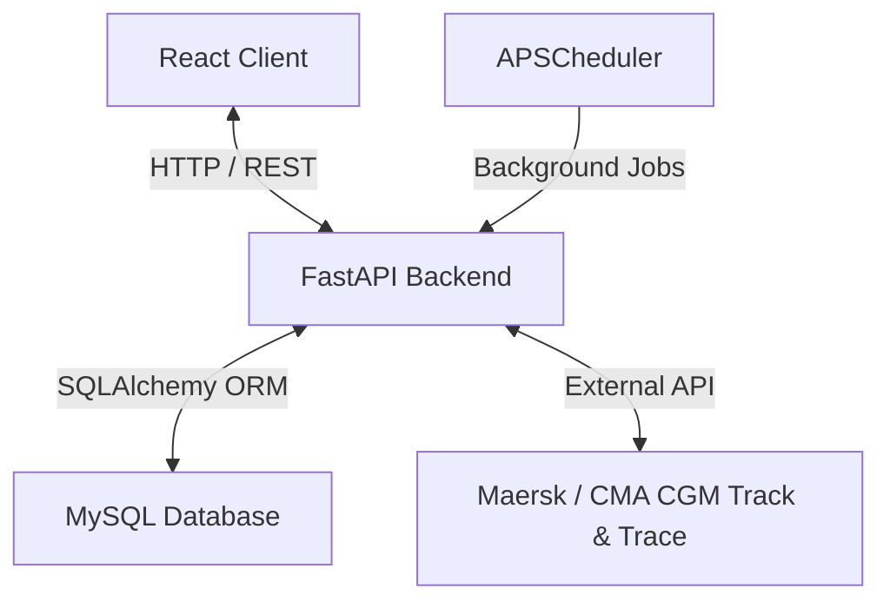
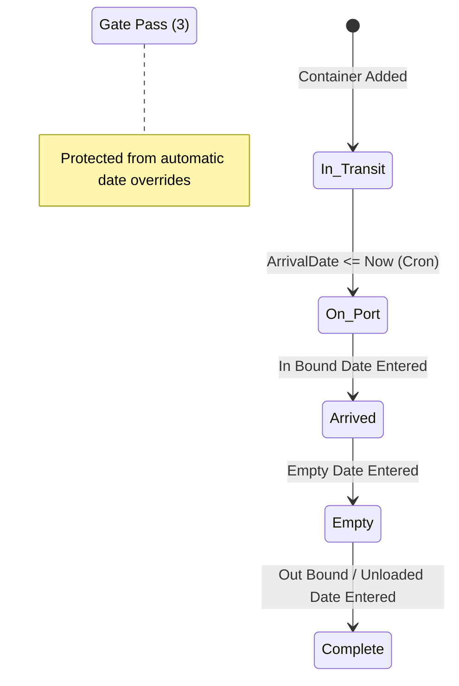

# FreightLens Project Design Documentation

This document describes the architectural design, system workflows, database models, and background task schedules of the **FreightLens** Container Management application.

---

## 🏛️ System Architecture

FreightLens is divided into three primary layers:
1. **Frontend (React)**: User interface for grid display, filtering, modals, settings, and forms.
2. **Backend (FastAPI)**: REST API with token authentication, database seeding, schema validation, and Maersk/CMA CGM tracking integrations.
3. **Database (MySQL)**: Relational database storing user credentials, permissions, logistics settings, container statuses, and tracking events.

---

## 🔒 Security & RBAC (Role-Based Access Control)

Authentication uses OAuth2 Bearer Tokens (JWT). Roles and permissions are initialized and maintained via `Model/seed.py` on startup.

### Permissions & Naming Conventions
Permissions follow the naming convention `<Action>_<Resource>` or `<View>_<ColumnName>`:
* **View Permissions**: e.g., `View_Dashboard`, `View_Container`, `View_BL`, `View_Report`, `View_Setting`, `View_User`, `View_Role`.
* **Action Permissions**: e.g., `Add_Container`, `Edit_Container`, `Delete_Container`, `Add_BillOfLanding`, etc.
* **Column Visibility Permissions**: control grid columns on the frontend (e.g., `View_Supplier`, `View_ArrivalDate`, `View_Demurrage`).

### Roles Mapping
* **`admin`**: Automatically linked to every permission in the database.
* **`Administrator`** (Existing/User-created): Dynamically synced on startup to ensure it holds all permissions.
* **`viewer`**: Linked only to read/view permissions (`View_*`).

---

## 📦 Container Lifecycle & Status States

Containers progress through multiple stages. The status transitions are determined by date fields and cron jobs.

### Status Definitions
| Status ID | Status Name | Color Code (Light/Dark Mode) | Trigger Condition |
| :---: | :--- | :--- | :--- |
| **1** | `In Transit` | Default / Slate | No dates set yet AND `ArrivalDate` is in the future. |
| **2** | `On Port` | Blue | `ArrivalDate <= Now` (vessel has docked). |
| **3** | `Gate Pass` | Green | Assigned manually; protected from automated status overrides. |
| **4** | `Complete` | Default / Slate | Out Bound Date or Unloaded at Port Date is set. |
| **6** | `Arrived` | Indigo | In Bound Date is set. |
| **7** | `Empty` (Unloaded) | Yellow | Empty Date is set (container returned). |
| **8** | `Unknown` | Default / Slate | Missing linked Bill of Lading or no dates are populated. |

### Status State Machine

---

## ⏱️ Background Jobs & Cron Schedules

Background tasks are managed using `APSCheduler` inside `cron_jobs.py`. They run three times a day at **04:00, 13:00, and 20:00 (local server time)**.

### Scheduled Tasks
1. **`updateArrivalDate` (Job 1 — Runs at :00)**:
   * Queries all active Bills of Lading whose `ArrivalDate` is in the future.
   * Calls the external Maersk / CMA CGM Track & Trace endpoints.
   * Updates the `ArrivalDate` in the database with the latest carrier ETA.
2. **`updateContainerStatus` (Job 2 — Runs at :01)**:
   * Automatically updates container status based on the linked Bill of Lading `ArrivalDate`.
   * Sets status to `On Port` if the vessel has arrived (`ArrivalDate <= Now`), or `In Transit` if still at sea.
   * Skips containers with manual overrides: `Gate Pass`, `Complete`, `Arrived`, `Empty`, or `Unknown`.

### Startup Backfill
* **`backfill_container_statuses`**: Runs once on application startup. Corrects historical records that were inserted before automated status transitions were defined, processing them through the priority chain from highest to lowest.

---

## 📅 Demurrage Calculation Flow

Demurrage represents the charges for storing containers past their allowed free days. 

### Excluded Days Bitmask
Logistics providers specify which days of the week are exempt from demurrage calculations (e.g., weekends). Days are encoded using a bitmask mapping:
* **Monday**: 1
* **Tuesday**: 2
* **Wednesday**: 4
* **Thursday**: 8
* **Friday**: 16
* **Saturday**: 32
* **Sunday**: 64

*Example*: Excluding Saturday + Sunday results in a bitmask of `32 + 64 = 96`.

### Step-by-Step Calculation Loop
1. Resolve the `ArrivalDate` of the parent Bill of Lading.
2. Determine `FreeDays` (checking individual container override first, falling back to the parent BoL value).
3. Starting from `ArrivalDate`, iterate day-by-day to find the due date:
   * Map the day of the week to its bitmask value.
   * If `(ExcludeDayBitmask & DayBit) === 0` (meaning the day is not excluded), increment the count of elapsed working days.
   * Stop once working days reach the allowed `FreeDays` limit.
4. Compare the calculated due date against the current time (`now`):
   * If `due > now`: Display `"Remaining time: X days"`.
   * If `due < now`: Highlight in **Red** and display `"Overdue by: Y days"`.
