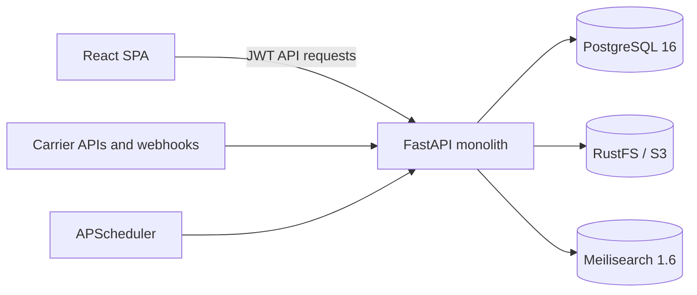

# FreightLens Backend Architecture

## Status

This document describes the current FreightLens v2 monolith. Update it in the same commit as any change to services, ports, environment variables, database structure, authentication, tenancy, storage, search, scheduling, routers, modules, or major dependency versions.

The future microservice proposal in `FUTURE_ARCHITECTURE.md` is not the current implementation.

## System

| Component | Implementation | Local port | Staging behavior |
| --- | --- | ---: | --- |
| Frontend | React SPA, nginx production image | 3000 | routed by Coolify; nginx listens on 4005 |
| API | FastAPI + Uvicorn, Python 3.11 | 9000 | internal port 6051 |
| Database | PostgreSQL 16 | 5433 | internal only |
| Object storage | RustFS, S3-compatible | 9005 API, 9006 console | internal only; console disabled |
| Search | Meilisearch 1.6 | 7700 | internal only |
| Jobs | APScheduler in the API process | n/a | starts with the API process |

## Request Flow

1. `containerMgmt.py` creates the FastAPI application and registers routers.
2. JWT authentication resolves the database user through `auth/dependencies.py`.
3. `get_org_context` resolves the caller's current organisation, allowed organisations, root status, and optional `X-Active-Org` selection.
4. Module-level access is enforced with `require_module` during router registration.
5. Endpoint-level permissions use helpers from `auth/security_guards.py`.
6. Queries on tenant-owned models use `apply_org_filter` from `Utils/org_filter.py` and filter soft-deleted rows.

The frontend permission checks are user-interface behavior only. The API is the security boundary.

## Modules

| Key | Scope |
| --- | --- |
| `LOGISTICS` | Containers, bills of lading, tracking, carrier integrations |
| `ORDERS` | Requests, sourcing, quotations, purchase orders, packing, receiving, defects |
| `INVENTORY` | Product master, categories, stock and product media |

Router authorization after the Phase 5 review:

- Logistics, orders, inventory, notifications, and logistics settings use module guards.
- Credential and admin-console routers require a root-tenant administrator.
- Reports, master data, dashboard, organisations, and reference information are deliberate cross-module/platform routers. Their endpoints require authentication and enforce their own permissions and organisation scope.
- Blob upload and health endpoints require authentication; browser media reads are the narrow signed-link exception.

## Data

PostgreSQL uses two schemas:

- `containermgmt`: operational and business data.
- `usercredentials`: users, roles, permissions, sessions, and organisations.

Tenant isolation is row-based through `org_id`. Root organisations may select an allowed organisation with `X-Active-Org`; non-root users are restricted to their allowed organisation IDs. `OrgMixin.org_id` is required and has no default. A SQLAlchemy `before_flush` guard rejects any new tenant-owned row without explicit ownership.

Suppliers use an explicit two-state scope: shared suppliers have `is_shared = true` and no `org_id`; tenant suppliers have `is_shared = false` and a required `org_id`. Queries expose shared suppliers plus only the caller's active/allowed tenant suppliers. Existing pre-migration suppliers are classified as shared to preserve visibility until reviewed.

Schema changes are idempotent `Utils/migrate_*.py` functions registered in `containerMgmt.py`. New migrations use a date prefix, such as `migrate_20261002_feature.py`.

Tables without `OrgMixin` are classified in `docs/TENANT_OWNERSHIP_AUDIT.md` as explicitly shared or parent-owned; nullable `org_id` is not used as an implicit sharing convention.

## Storage and Search

- `Utils/blob_storage.py` is the only object-storage client.
- Local fallback files are confined to `Backend/BLOB`.
- Direct `/blobs` reads require an expiring HMAC signature. Product media links live for 24 hours; supplier-logo links live for 15 minutes.
- Order and operational documents are accessed through their owning authenticated endpoints.
- `Services/search_service.py` owns Meilisearch clients, index configuration, synchronization, and SQL fallback behavior.
- Every search must apply organisation and soft-delete filters.

## Startup

Application startup currently verifies database schemas, runs idempotent migrations, seeds reference and RBAC data, runs the container-status backfill, verifies RustFS, and rebuilds product and purchase-order search indexes.

APScheduler currently starts at module import time. This can duplicate jobs under multiple workers and is a known deviation scheduled for migration to FastAPI lifespan handling.

## Configuration

Deployment-specific environment variables include `DATABASE_URL`, JWT settings, `MEDIA_SIGNING_KEY`, `CMA_CGM_WEBHOOK_SECRET`, environment/CORS/host settings, RustFS credentials, Meilisearch credentials, and carrier credentials prefixed by `CMA_CGM_` and `MEARSK_`.

`MEDIA_SIGNING_KEY` must be random, must differ from `JWT_SECRET_KEY`, and must match across API instances in the same environment.
`CMA_CGM_WEBHOOK_SECRET` authenticates inbound carrier events through `X-Webhook-Secret` and must be stored only in deployment configuration. Staging and production refuse to start when any required security secret is absent.

Secrets must come from local `.env` or the deployment platform and must not be committed.

## Deployment Traceability

The paired `baseline-2026-10` tag identifies the v2 mainline in both repositories before stabilization. Future deploys must use matching tags in both repositories. Application-version exposure through `/health` and the frontend footer remains to be implemented.
