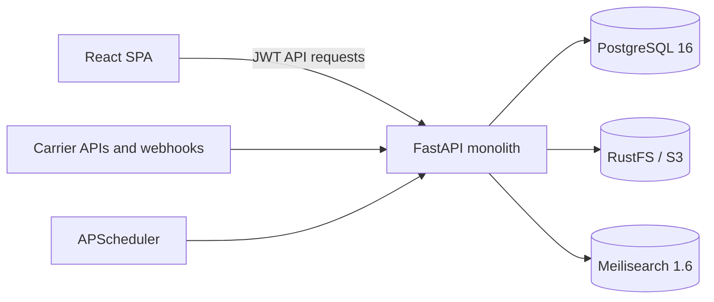

# FreightLens Backend Architecture

## Status

### Central cost-pool writer authority (T06 foundation)

`CostPoolAuthorityEpoch` extends existing authority models and reuses StoreNode
identities. It is separate from branch stock ownership: one organisation/cost pool
has a consecutive ACTIVE/SUSPENDED writer-epoch history. Composite foreign keys
bind the pool and node to the same company; immutable triggers reject history
changes. The unique org/pool/epoch index supports current-writer lookup.
`require_cost_pool_authority` accepts a typed trusted runtime claim, requires an
active exact-company pool and matching current node/epoch, and holds a shared pool
lock to transaction end. Epoch insertion takes the exclusive pool lock, preventing
an authority change beneath an in-flight posting. Missing/suspended/stale/foreign
claims fail closed; branch authority never substitutes for central authority.

The additive startup migration `migrate_20261003_cost_pool_authority.py` creates an
empty table and guards, with bounded lock wait and no seeds. Tests connect the real
guard to the charge coordinator and verify replay revocation and concurrency. This
is same-database fencing only: runtime authentication, reviewed enrollment/transition
APIs and disconnected recovery remain gates.
No HTTP authority writer or financial-posting activation is exposed. Evidence:
planning/evidence/t06-pool-authority-verification.txt.

Both charge coordinator entry points now require CostPoolAuthorityClaim. The
database guard runs before evidence work and replay, with an exact proposal/pool
check. The full organisation/pool/node/epoch identity is included in the normalized
operation request. A valid newer epoch cannot relabel an old operation, while its
old claim is rejected as stale. Additional runtime checks remain callbacks but
cannot bypass the persisted guard. Earlier internal intents without authority
identity conflict rather than being silently reinterpreted. No runtime identity
is inferred from user roles or request fields; authenticated enrollment remains
required before any public adapter. No schema change in this integration slice.
Evidence: planning/evidence/t06-authority-intent-verification.txt.

The existing paginated cost-pool GET now adds central_authority_state and epoch
without exposing node identities, reasons or credentials. One company-scoped
DISTINCT ON query covers only pool IDs on the returned page, using the authority
history index; no per-row API/query loop. NOT_CONFIGURED is explicit; ACTIVE means
writer assigned, not runtime authenticated or financial posting enabled. Existing
INVENTORY/View_Product access remains mandatory. The CostPoolSetup table displays
these read-only states and clears stale presentation on failed refresh. No
enrollment control or new screen is introduced. Browser acceptance remains pending.

### Source-linked opening valuation (T06 in progress)

The same immutable ledger now supports OPENING and CHARGE kinds. Charge rows add
value, never quantity, and reference their original opening. A partial unique
opening-source index preserves opening deduplication; operation/balance uniqueness
permits multi-line allocations. The additive valuation_charges migration preserves
historical values and is replayable. Database insert guards require the matching
allocation, whole-charge use and version-2 evidence-case use in the same operation.
`append_allocated_charge_values` uses the caller's transaction and explicit guard,
locks product streams deterministically, checks expected versions and conservation,
and rejects physical movement pending late-cost reconciliation. It never commits,
changes selling prices or performs storage I/O. Allocation previews exclude CHARGE
rows, preventing recursive allocation. History exposes kind and source reference.
`charge_posting_service.post_allocated_charge` now composes case/charge consumption,
entries, receipt and outbox in one transaction using the existing services. Its
intent binds exact prepared evidence, proposal, case and product-stream versions.
Mandatory permission and central-authority callbacks run before replay; exact
current content/source checks remain mandatory. Caller-owned sessions are supported
without committing. No storage I/O occurs inside posting. The authenticated central
runtime adapter/public writer is still pending; branch stock authority must not be
substituted for shared-pool valuation authority. No public financial posting is
enabled. Evidence: planning/evidence/t06-charge-posting-verification.txt; ledger
schema evidence: planning/evidence/t06-charge-valuation-verification.txt.

`prepare_and_post_allocated_charge` is the factory-owned entry point connecting
the existing preparation and coordinator. It resolves the persisted v2 case
internally and rejects foreign, legacy or mismatched proposal bindings before
storage access. Permission and central-authority guards precede preparation and
run again inside posting. The preparation transaction closes before pinned-version
reads; every retry rereads those original versions. Missing evidence blocks even
completed receipt replay without undoing the original posting. No client hashes,
latest-file fallback or automatic bucket changes are accepted. The shared exact
company/proposal/case lookup uses the existing (org_id, case_key) unique index.
`reviewed_charge_binding` reuses approval/source validation before file I/O:
pending/rejected cases cannot trigger evidence reads, and root allowed-company
lists do not widen the active company. Saved fingerprints are only preparation
inputs, not proof of current bytes; the subsequent storage read remains mandatory.
The runtime authority adapter remains required; no HTTP route calls this entry point.
Evidence: planning/evidence/t06-prepared-posting-verification.txt.
Persisted-loader verification: planning/evidence/t06-persisted-case-verification.txt.

The approved-evidence loader now supports narrowly scoped own-operation replay.
Default callers still reject consumed cases. A replay requires exact actor/key,
matching case use, matching whole-charge use/evidence and a committed receipt under
inventory.valuation.charge.v1. Permissions and current content/source bindings are
checked first; outer execute_once must still match the full request digest and
return the prior result without applying another effect. This is a replay guard,
not the freight valuation writer; no financial-posting endpoint is enabled.
Read-only local storage inspection found versioning NOT_ENABLED and no configured
COST_EVIDENCE_MAX_BYTES. Neither setting was changed; live capture acceptance stays
blocked while independent development proceeds. Evidence:
planning/evidence/t06-evidence-own-replay-verification.txt.

Public evidence requests now use two-stage preparation and persist version-2 cases.
Retries read the original saved object versions rather than capturing replacement
files; changed declarations or metadata conflict. Reviews re-read pinned content
outside posting, then start a fresh caller-owned transaction and compare locked
sources before invoking the same manager-case engine. PostgreSQL guidance informed
short preparation transactions and exact active-company lookups. Legacy version-1
cases retain their historical review path and remain ineligible for financial use.

Case-scoped document downloads authorize the pool/proposal/case/document chain,
read the exact recorded version through blob_storage, and buffer only up to the
configured limit. Complete size and SHA256 comparison must pass before any bytes
are returned. No latest-version or disk fallback exists on that endpoint. Eligibility
is checked again after I/O; responses are attachment/no-store with no storage keys.
The React evidence panel selects this endpoint for v2 and labels historical v1
downloads as current files, not verified historical bytes.

New capture and pinned downloads require positive `COST_EVIDENCE_MAX_BYTES`; absent
or invalid configuration returns503. No actual value or bucket setting is seeded.
Storage version retention and provider compatibility still need real acceptance;
this enables reviews, never financial posting. No migration. Verification:
planning/evidence/t06-public-versioned-evidence-verification.txt.

`cost_content_preparation_service.prepare_charge_content` now bridges the strict
storage reader and typed review fingerprints. An authorized source loader runs in
a short factory-owned transaction, whose detached snapshot is retained; storage
reads occur only after it closes. Reviews require exact saved versions, bucket/key,
digest and size; missing identities cannot fall back to latest content. Returned
PreparedChargeContent supplies a require_current comparison for the later locked
source check and a detached typed map. Owning adapters must reauthorize before
posting. This internal preparation creates no approval or financial record; public
capture/download integration remains pending. Targeted evidence:
planning/evidence/t06-content-preparation-verification.txt.

Content-bound review support now persists typed DocumentContentFingerprint maps in
existing immutable manager-case bindings under source_version 2. The trusted owning
adapter prepares/re-reads exact versioned content BEFORE the posting transaction;
callbacks do no storage I/O. Locked document keys/known sizes must match, and every
linked invoice/FX document must have exactly one typed fingerprint, with no extras.
Version, bucket, digest and byte-count changes invalidate the exact review snapshot.
`approved_charge_evidence` now rejects all source_version 1 metadata-only approvals
and requires current server-prepared content even for version 2. Historical records
are not rewritten or upgraded. Shared permission, independent-decision and single-use
checks remain. Public HTTP capture/downloads still use metadata-only cases and cannot
supply financial evidence; next wire a two-stage capture outside the transaction,
then exact-version reviewer downloads. No new schema, UI or financial posting.
Evidence: planning/evidence/t06-content-review-binding-verification.txt.

`RustFSClient.fingerprint_file_version` adds an internal strict evidence reader to
the existing storage adapter. It computes SHA256 over a bounded complete stream,
pins/rechecks a non-null server version ID, rejects unknown/oversized/truncated
content, and closes bodies on failure. There is no local fallback, configuration
mutation, upload, presigned link or new HTTP authority. The caller must authorize
and resolve a company-owned document first and supply an explicit byte limit.
The result includes private bucket/key/version metadata and must not be exposed
through general reads. This is NOT Object Lock or retention verification. Public
reviews/downloads still use their existing metadata contract until the next
integration; historical cases must never silently acquire byte verification.
Evidence: planning/evidence/t06-versioned-blob-verification.txt.

`CostChargeDeclaration` and `cost_charge_review_service` now provide the internal
evidence-bound manager-case adapter, distinct from allocation-only approval.
The action `inventory.cost.verify-charge` binds the exact existing allocation,
issuer, invoice reference/date, declared eligible source amount, SCR-per-source-unit
rate, capitalisation explanation, invoice/FX document metadata and linked PO state.
Foreign currency requires explicit FX evidence; SCR requires rate1. `charge-fx-v1`
converts exact six-place amounts with eight-place rates using isolated Decimal
precision and HALF_UP six-place SCR rounding, rejects overflow/rounded-zero, and
requires the result to equal the complete saved allocation. No market rate or tax
treatment is inferred. Eligibility is a reviewer declaration, not automatic law.

Sources are permission-guarded before lookup, scoped and locked; linked POs must
belong to the company and the invoice PO must name the declared supplier. Original
metadata snapshots detect changed paths, dates, confidentiality and parent state.
The shared case service supplies immutable decisions, self-review denial and
single-use semantics. `approved_charge_evidence` accepts only the distinct approved,
independently reviewed, current and unconsumed charge case and returns the existing
typed CostChargeEvidence fingerprint. Allocation-only approvals never satisfy it.
This is not a public writer or financial authority: the same case must still be
consumed with charge use and valuation atomically. Own-operation replay after
consumption must be explicitly composed by that future coordinator.

No schema migration or second invoice/approval store is needed. CostEvidenceRouter
now exposes bounded existing supplier/document choices, explicit safe case projections,
request/review endpoints and authenticated UUID document downloads via blob_storage.
Both INVENTORY and ORDERS modules and product/supplier/document/financial permissions
are mandatory; financial and supplier field policies can still deny access. Writes
also require Manage_Financials. Exact active-company filters remain in root contexts.
The initial document selector accepts GENERAL/PO only, rejects mismatched/unbound PO
parents and excludes payment/quotation records. No private storage keys or raw case
bindings are returned. Downloads recheck eligibility, have no legacy fallback and
are attachment-only/no-store. Allocation-only APIs remain permission-separated.

React adds a shared paginated evidence picker and exact declaration form to saved
cost proposals, then adapts the existing ManagerCases screen for independent evidence
review. Failed saves retain fields and operation identity; exits require explicit
discard. No financial posting is exposed. Immutable blob-version guarantees remain
a posting gate: metadata hashing cannot prove bytes or prevent in-place replacement.
Browser acceptance remains pending. Evidence:
planning/evidence/t06-evidence-workspace-verification.txt.

The internal `cost_charge_use_service` adds whole-charge duplicate protection;
it is not an invoice store, payable ledger, evidence verifier or public writer.
It references existing Supplier, OrderDocument and CostAllocationProposal records.
`CostChargeUse` reserves organisation/supplier/canonical-invoice identity plus
unique proposal and evidence-document use, regardless of pool or operation UUID.
Reference case/separator variants collide conservatively; leading zeros remain
significant. Ambiguous identifiers, invoice splitting and multi-invoice documents
remain unsupported rather than acquiring a bypass. No actual records are seeded.

`check_cost_charge` belongs in the outer posting guard on every attempt/replay;
`consume_cost_charge` belongs inside the same transaction as valuation and case
consumption. Neither commits or creates a receipt. Mandatory trusted callbacks
must verify current source/FX evidence and permission/central authority/approvals.
The typed fingerprint is a comparison contract, not proof that verification exists.
SQL constraints and triggers enforce source ownership, exact proposal total,
uniqueness, immutable snapshots and a deferred posting-operation FK. Charge-identity
advisory locking followed by supplier/document shared locks and a proposal lock
serializes concurrent duplicate domains; no charge can commit without its receipt.
Source/permission revocation still rejects a historical retry. Migration
`migrate_20261003_cost_charge_uses.py` is additive, replayable and bounded-lock.

Purchasing currently has invoice reference text, documents and payment amounts,
not authoritative approved capitalisable-charge/FX records. No adapter may infer
verification from those values or call the new consumer from an allocation review.
Existing review screens remain accurate and unchanged: approval is not posting.
Evidence: planning/evidence/t06-charge-dedup-verification.txt. T06 remains in progress.

`InventoryValuation` is append-only, scoped to organisation/pool/product and the
original physical opening movement. Composite foreign keys preserve ownership;
unique source and pool/product version keys prevent double valuation. Six-place
SCR values and base quantities are retained with calculation policy pool-wac-v2.
The immutable after-snapshot is historical, not physical stock availability.
`migrate_20261003_inventory_valuation.py` creates the empty table and update/delete
guard with bounded lock wait; it never infers costs or imports legacy prices.

`record_opening_value` is internal-only. It requires a permission/cost-evidence/
central-authority callback before every attempt and replay, derives quantity from
the original movement and pool from the explicit branch binding, serializes on
product, checks stream version, reuses exact receive arithmetic and commits the
valuation and existing posting receipt/event together. Shared Session rollback is
retained. All entries are UNRECONCILED: no final central/offline accounting claim.
No public writer is enabled before authoritative evidence and runtime integration.

GET `/inventory/cost-pools/{id}/valuations` requires INVENTORY, View_Product and
View_Financials before querying costs. Same-company parent joins and bounded server
pagination return typed decimal strings. The Cost pools workspace exposes a
permission-aware historical register using the existing client and pagination.
No-cost-record is not zero cost; no new dashboard total or selling price is derived.
Receipt integration, approved freight allocations, cost corrections, central
reconciliation and reclassification value conservation remain T06 work.

The same financially protected router exposes read-only POST
`/inventory/cost-pools/{id}/allocate-cost-preview`. At most100 distinct immutable
valuation sources must all resolve within the exact pool/company and visible
parents. The shared visibility query serves history and preview, preventing an
alternative lookup path from widening access. Original goods values or same-unit
base quantities supply weights; cumulative pool snapshots never do. Mixed base
units block quantity allocation. Zero total weight blocks either basis. Existing
largest-remainder arithmetic conserves the six-place SCR total deterministically.
The Cost pools history panel selects current-page sources and displays a preview
with input-change/unmount cancellation and no posting action. It creates no
allocation document, approval, charge, valuation, stock or price mutation.
Commercial invoice/FX/capitalisation evidence and eventual receipt/approval
integration remain required; this calculation is not final reconciliation.

Allocation previews can now be saved as immutable `CostAllocationProposal` records.
`migrate_20261003_cost_allocation.py` creates an empty table, same-company pool FK,
deferred posting-operation FK and immutable update/delete guard. The internal save
adapter requires both authorization and an authoritative snapshot loader; the HTTP
adapter reuses the exact preview query/calculation on every attempt. Existing
operation receipts provide actor-bound retry protection and atomic rollback.
IDs are sorted and SCR totals normalized for stable intent; original records are
never overwritten. Saving is NOT a valuation posting or manager approval.

POST `/inventory/cost-pools/{id}/allocation-proposals` requires View_Product,
View_Financials and Manage_Financials. Paginated GET and UUID detail GET require
the two view permissions under INVENTORY. List projections omit large snapshots;
detail exposes declared reference/reason and exact historical allocation. Same-pool
company lookup is mandatory, including for retries. A textual charge reference is
unverified evidence, not authoritative invoice identity or posting deduplication.
Different operation IDs can deliberately create separate unposted proposals;
business charge deduplication must precede financial consumption. Allocation
review alone does not validate supplier evidence or authorize capitalisation.

Frontend reuses the preview, operation-intent helper and pagination. Financial
managers may save with reference/reason; all financial viewers can reopen saved
proposals. Failed saves retain inputs/key; in-panel discard and unload warnings
protect evidence, and list/detail results bind their exact request context.
Independent allocation review now reuses ManagerCase/Decision and the existing
request/review receipt boundary; no parallel approval tables or migration.
Company/pool/proposal-scoped request-review, cases and decision endpoints live in
CostPoolRouter. Writes require View_Product, View_Financials and Manage_Financials;
reads require both view permissions. The loader locks the immutable proposal and
recalculates source eligibility on every attempt/replay. Exact manifest, allocation
and creator identity bind the case. Both creator and requester are prohibited from
reviewing, including proxy requests. Needs-my-review excludes both before paging.
Decisions remain immutable; concurrent/repeated decisions have one effect.
The frontend reuses ManagerCases and PolicyReviewRequest with cost-specific labels,
exact allocation lines, permission-aware actions and failed-request/decision draft
protection. No activation or charge-posting control is exposed.
Verified supplier/FX evidence, charge identity/deduplication, single-use financial
consumption and central reconciliation remain T06 work. New browser acceptance is
pending; no price or physical stock changes or final reconciliation are implied.

### Immutable reclassification proposals (T05 internal integration)

`StockReclassificationProposal` stores a UUID-keyed immutable source snapshot and
explicit manifest, scoped by organisation and source balance. A composite balance
FK prevents cross-company references; a deferred operation FK requires the matching
atomic receipt. The additive startup migration
`migrate_20261002_stock_reclassification.py` creates an empty table and immutable
guards with bounded lock wait. It is replayable and performs no backfill.

`reclassification_proposal_service.save_proposal` reuses execute_once with a
mandatory action permission callback on every attempt, including replay. It locks
product then balance, checks exact stock/active-policy/draft versions, reconciles
the explicit manifest and stores the authoritative snapshot with its receipt.
Saving changes no stock and claims no physical posting authority. Retries reject
stale sources rather than refreshing an old proposal silently. Changed proposals
require a new key; original records remain immutable.

`load_proposal_binding` revalidates the locked source and supplies the existing
manager-case engine with action inventory.stock.reclassify and the full manifest/
source binding. Self-review and source changes are rejected by shared review rules.
The proposal HTTP adapter provides POST plus paginated GET and UUID detail GET at
`/inventory/reclassification-proposals` under INVENTORY. Saving requires existing
Request_InventoryReview; reads require View_Product. Parent product/location/branch
and exact active company are checked, including soft deletion and shared-product
exclusion. Lists load compact snapshots/reasons, not full identity manifests.
Detail reads expose an explicitly historical snapshot, not current eligibility;
all responses mark conversion disabled. The location-stock screen now links each
balance to a read-only paginated proposal register and historical manifest detail.
It reuses the company-pinned inventory client and PaginationToolbar, preserves
decimal strings, aborts obsolete requests, clears failed refresh results and binds
selection to the API/company context. The permission-aware editor now accepts
explicit batch/serial manifests, pins source versions and retains failed-save
intent keys. Request-review, paginated proposal cases and independent decisions
reuse the existing manager-case engine and frontend panels. Public request/review
adapters revalidate source versions even on replay; foreign requests and self-review
are denied. Review requires Review_InventoryPolicy; request requires
Request_InventoryReview. No new grants or approval store are introduced.
Approval does not enable execution. No conversion consumer exists yet.
Node fencing, global batch/serial collision checks, product-wide compatibility,
valuation conservation and atomic lineage/movements remain conversion release gates.

### Stock reclassification reconciliation contract (T05 preparation)

`stock_reclassification_service.validate_reclassification` is a pure validator,
not a writer or approval. It reuses QuantityBreakdown, exact unit conversion,
StockBatchIdentity and SerialOpening. A single authoritative ordinary-stock balance
can be reconciled to an explicit batch or serial manifest in the same base unit and
location. On-hand, damaged and quarantined totals must each be conserved exactly;
reserved stock, rounding, missing required metadata, duplicate batch identities,
tracking removal, base-unit changes and mixed manifests are rejected. Manifests
are bounded to1000 entries. Decimal arithmetic does not inherit caller precision.

No HTTP route or UI action consumes this contract yet. Future integration must load
scoped locked source rows, check versions/node authority and global identity
uniqueness, bind exact manifests to independent manager review, and atomically
record source/destination movements and lineage without rewriting original rules.
Reservation resolution requires its own approval; the validator never releases a
hold. Value preservation/reconciliation and product-wide policy compatibility are
additional posting gates, not established by quantity conservation alone.

### Compatible alternate-unit extensions and local demo (T05 partial)

`policy_compatibility_service.extends_policy` permits additive alternate units only:
base unit, quantity increment, tracking/required metadata and every original unit
name/factor must remain unchanged. Decimal-equivalent factors are accepted. The
shared transition check streams distinct organisation/product stock snapshots and
checks barcode source policies; missing/incompatible history or legacy quantities
blocks activation. Existing product locks and manager-case/posting engines remain
the authority boundary. No stock quantities, original policy snapshots or barcode
identities are rewritten.

Both no-history and compatible-extension checks share `live_barcode_query`.
Only committed same-company retirement excludes a code. Retired ancestors do not
block subsequent safe extensions after a reviewed setup correction. Live codes use
a scoped outer join to their original policy: missing or incompatible snapshots
produce an explicit blocker, never disappear through an inner join. Existing
retirement uniqueness and policy ownership indexes support these probes.

New additive cases bind `transition: EXTEND_UNITS`, exposed by the typed read API,
and consume `inventory.policy.extend-units.v1`. Historical bindings stay unchanged.
Readiness exposes COMPATIBLE_REVISION_REVIEW but never authorises posting. The stock
service accepts the current reviewed policy only when it extends the balance's
original rules; new units then work for reservation/release. Future openings check
every original snapshot. Without an active reviewed policy, strict original JSON
equality remains required. Barcode lookup validates original/current compatibility
and exact factor, returning the original identity/version, never a silent rebind.

Frontend reuses existing draft/review panels. Approved execution controls live in
a non-scrolling footer; the existing company selector is mounted in the main header.
`Utils/seed_t05_demo.py` is an explicit CLI, never a startup hook: guarded local
preview database plus confirmation, transaction/advisory lock, fixed demo identity,
synthetic actors/products/stock/cases only. It adds only demo scope to existing local
preview administrators, never changes their roles or credentials. Repeated runs
retain the same demo company. Tests use the isolated test database and rollback.
No schema migration is required. Evidence: planning/evidence/t05-extension-demo-verification.txt.
Physical stock reclassification and reuse/rebinding of historical codes remain
disabled; no valuation, selling price or real-company business data is changed.

### Reviewed barcode retirement (T05 partial)

Unit barcodes can be permanently disabled through the existing manager-case and
posting engines. `/inventory/barcode-retirement-cases` exposes paginated personal
views and separate request, review and retirement actions under INVENTORY and
Request_BarcodeRetirement / Review_BarcodeRetirement / Retire_InventoryBarcode.
Approval binds the exact barcode, unit/factor, product and active-policy snapshot;
self-review, changed sources, foreign cases and double consumption are rejected.
Retirement is an explicit action after approval, not a consequence of review.

`UnitBarcodeRetirement` is append-only, unique per original identity and tied to
the consumed case and posting receipt. Startup migration
`migrate_20261002_barcode_retirements.py` creates empty tables/guards without seeds.
Posting takes operation lock before product and case locks. Retirement, case use,
receipt and outbox share a transaction; rollback restores eligibility. Retries
recheck permissions and sources, permitting only the exact operation's own effect.
SQL guards reject unscoped/unapproved inserts and updates/deletes.

Historical barcode lists expose `retired`; resolver and registration retries reject
retired identities. Codes remain reserved, never deleted or silently reassigned.
The frontend reuses request, review and confirmed-action components, with a separate
Barcode reviews entry. `manager_case_read_service` shares scoped pagination/filter
logic with policy reviews. Failed request drafts retain retry identities and reasons.
Recorded T05 tablet/browser checks passed. No stock or valuation is changed; correction,
rebinding and existing-stock policy conversion remain separate reviewed workflows.

### Reviewed policy revisions before stock history (T05 partial)

The existing activation/case workflow now supports a new immutable policy version
only when the product has explicit zero legacy stock and no stock balances, batch
identities, serial identities or live registered unit barcodes. Even zero-quantity
historical balances block this route. Permanently retired codes no longer block
no-stock revisions: an indexed same-company NOT EXISTS probe excludes only
committed retirements, not pending approvals. Original codes stay reserved and
unusable after revision; new registrations bind the new policy. The existing
product lock serializes registration, retirement and revision.
`policy_transition_service` centralizes these
checks for posting and the advisory readiness read; indexed existence probes avoid
loading growing registers or sensitive catalogue relationships.

Revision cases bind the predecessor active version as well as the exact saved draft.
Posting locks the product, rechecks scope/source/eligibility and consumes approval
in the same transaction as the activation and receipt. Initial operation kind stays
`inventory.policy.activate.v1`; revisions use `inventory.policy.revise-empty.v1`.
Only a latest activation owned by the exact retry operation can normalize the
predecessor for replay; changed drafts, newer activations and mismatched intents
remain conflicts. Initial historical bindings remain compatible.

GET `/inventory/products/{id}/inventory-policy/transition-readiness` uses INVENTORY/
View_Product, exact active-company scope and typed versions, changed fields and
blocking reasons. It checks saved rules, does not lock a stock snapshot or authorize
posting, and is explicitly advisory. The draft UI invalidates results on editing
or revision changes; manager cases show the predecessor and submit that version.
No schema migration is needed: existing immutable revisions and scoped keys suffice.
Readiness also returns typed active/proposed configuration snapshots from the same
loaded revisions. The existing panel compares all seven policy fields, preserving
decimal factor strings and displaying blockers alongside changes. This is a bounded
configuration comparison, not a stock register or an approval. Changing product,
API/company context or draft editing state aborts and clears obsolete UI results.
Existing-stock conversion and barcode rebinding remain blocked pending
their reviewed workflows; no stock, valuation, catalogue unit or price is changed.

### Unit-aware barcode identities (T05 partial)

`UnitBarcode` stores permanent company-unique, case-sensitive codes preserving
leading zeros, linked to the existing product and exact reviewed policy version.
Unit/factor snapshots are derived server-side from that policy, not supplied by
the caller or inferred from packaging/legacy catalogue barcode. Decimal factors
remain strings on typed API responses. No catalogue or product duplication.
Registration uses existing atomic posting/replay service plus product lock; a
unique company/code constraint resolves competing registrations across products.
Immutable rows and deferred posting FK preserve audit/rollback. Startup migration
`migrate_20261002_unit_barcodes.py` creates empty tables/guards and seeds nothing.

INVENTORY `/inventory/unit-barcodes/products/{id}` offers paginated View_Product
GET and Manage_InventoryBarcode POST with expected policy version/operation UUID.
`/inventory/unit-barcodes/resolve?code=...` performs exact company-scoped lookup;
unknown legacy codes never fall back. Inactive products or changed active policies
block resolution. Historical list rows retain original unit/factor and show review
required rather than silently reinterpret. Lookup is not sale/stock authority.
The policy dialog exposes Unit barcodes with explicit unit choice, stable retries,
failed-save/discard protection and read-only checking. Browser acceptance deferred.
Barcode correction/rebinding remains a reviewed follow-up; the original
registration API deliberately permits no deletion or reassignment.

### Consolidation contracts

The canonical execution queue is `docs/planning/TASK-QUEUE.txt`; the parent
workspace queue is a pointer. Historical checkpoint documents are evidence, not
competing current backlogs. Customer and source-document A-slices now precede
reservation completion, and durable draft recovery precedes tablet checkout.

`settings_revision_service` shares configuration-operation locking, matching
historical retry and expected-version checks between branch/counter routes.
Namespaces, transaction ownership, parent/permission checks, response contracts
and stored history remain unchanged. This is not a second posting ledger; no
stock outbox/receipt or automatic retry is introduced for configuration writes.
Future sync must explicitly define configuration events rather than assume them.

### Initial reviewed policy activation (T05 partial)

`policy_activation_service` consumes an approved exact saved-policy case and writes
an immutable active snapshot plus operation receipt in one transaction. Product
locking serializes activation with draft saves and internal stock opening. The
first slice permits only products with explicit zero legacy quantity and no stock
balance/batch history; existing stock and subsequent transitions fail closed.
Changed source details reject both fresh attempts and historical retries.
`migrate_20261002_policy_activation.py` creates the activation table and guards;
its table-lock wait is bounded. No real policies or quantities are seeded.

POST `/inventory/manager-cases/{key}/activate-policy` requires
`Activate_InventoryPolicy`; GET `/inventory/products/{id}/inventory-policy`
requires View_Product. The frontend separates active policy from editable draft
and requires explicit confirmation in the approved-case panel. Activation does
not enable checkout or create stock. Internal openings must match any active
policy; pre-activation internal test adapters still require explicit policy and
authority, pending T08 integration. A product SQL trigger prevents legacy writers
changing activated units, scope or stock totals; catalogue edit returns409 for
unit/quantity conflicts. Full legacy-writer routing remains T08.

Remaining T05: reviewed stock conversions and barcode correction/rebinding. No
barcode is inferred from the legacy catalogue barcode or packaging fields.

### Manager-case foundation (T04)

The existing paginated case register accepts ALL (compatible default),
NEEDS_MY_REVIEW and MY_REQUESTS. Identity comes from the authenticated user.
Personal review filters exclude own requests and any decision/use before count
and pagination using scoped indexed existence probes. The queue is shared with
other eligible reviewers, not exclusive assignment or proof that a saved source
is still current. Existing locked review/activation checks remain authoritative.
The standalone frontend defaults to Needs my review and the profile area links
to it; contextual case panels retain All by default. No duplicate cases, notification
rows, migrations, subscriptions or background polling. Durable unread/recipient
notification delivery remains pending, separate from this personal queue slice.

`manager_case_service` provides immutable requests, decisions and single-use
approval consumption inside the existing atomic posting boundary. Every attempt,
including replay, authorizes and locks/reloads exact source/action/version/details.
SQL guards reject self-review and unapproved use; unique use and deferred receipt
FK enforce atomic consumption. `migrate_20261002_manager_cases.py` adds empty tables.
The INVENTORY `/inventory/manager-cases` adapter supports saved-policy requests
(`Request_InventoryReview`) and paginated review (`Review_InventoryPolicy`). No
arbitrary client binding is accepted; changed drafts invalidate approval.
Approval alone does not activate tracking. Existing purchasing approvals remain
unchanged. Personal manager-profile notifications and browser acceptance remain
pending; the organisation-wide notification feed is not used for case details.

### Posting composition and local authority foundation (2026-10-02)

`inventory_posting_service.execute_in_transaction` joins an active caller-owned
Session with a mandatory authorization callback, executed before receipt replay.
It never commits; failures within the boundary roll back the entire transaction.
Its outcome remains provisional until outer commit. `execute_once` retains its
factory-owned compatibility path and can accept a shared Session. Internal stock
opening/reserve/release adapters support the same session and authorization guard;
pre-boundary validation errors must propagate out of the caller's transaction.
Callbacks must not commit/rollback or perform network/printing side effects.

`inventory_store_nodes` and `inventory_branch_authority_epochs` are audited,
tenant-owned immutable identities/history. Composite foreign keys enforce branch
and node ownership. The append trigger locks the branch and requires consecutive
epochs. `require_posting_authority` takes a trusted runtime claim and holds a
shared branch lock through commit, rejecting missing/suspended/stale/foreign
authority. This is local database fencing, not disconnected-server failover.
The additive startup migration is `migrate_20261002_posting_authority.py`; no nodes
or epochs are seeded. No enrollment/transition HTTP route or configuration UI is
enabled. Permissions and source/version checks remain additional requirements.
All stock adapters now require an AuthorityClaim and action/source callback for
both factory-owned and shared transactions. `_post_stock` resolves immutable
balance scope, verifies exact branch ownership and active parents before replay,
and fingerprints org/branch/node/epoch under an `.authority-v1` operation kind.
Changed epochs cannot relabel historical intent. Locked balances and holds use
populate_existing so caller-preloaded ORM state cannot overwrite newer quantities.
The generic posting helper retains internal compatibility, but no stock adapter
can use that as an authorization-free path. T02 foundation checks are verified;
there is still no public stock posting or client-supplied node authentication. Reviewed
authority transitions, enrollment and distributed recovery have later release gates.
Current execution order: parent `planning/TASK-QUEUE.txt` (T01-T34).

### Branch business-date calculation (T03 in progress)

`branch_business_date_service` is a pure, currently unconnected calculation.
It requires explicit IANA timezone, weekday/weekend local cutoffs and a configured
trading-weekday set (an empty set means explicitly closed). A business date starts
at that calendar date's cutoff; Saturday/Sunday use the weekend cutoff. Exact-date
open/closed exceptions override the weekly calendar, allowing selected holidays.
Missing configuration fails closed. A timezone-aware trusted instant is required.
Date attribution and trading eligibility are separate, so a closed sales calendar
does not itself prohibit physical collection. Collection keeps its own gates.
No real hours are guessed or seeded. Persistence, versioned APIs, branch/counter
permissions and settings UI remain T03 work; no operational behavior is enabled.

T03 implementation update: branch settings and counter identities/revisions now
persist in immutable tenant-scoped tables with composite ownership constraints.
The `/inventory/branches/{id}/settings` GET/PUT and `/counters` paginated GET plus
`/counters/{uuid}` PUT use INVENTORY, View_Product and Manage_BranchSettings guards.
Writes require stable operation IDs and expected versions, with operation/branch
locks, immutable retries and no code/reparent mutation. Calendar config permits
up to366 explicit date exceptions; NULL required fields mean incomplete rather
than guessed values. Counter purpose is explicit, disabled initially by default.
`operational_activation` remains false on all responses: setup is not checkout.

`require_branch_action_context` checks current branch/counter settings versions
under a shared branch lock through caller commit, invokes an additional permission
guard, and resolves trusted business date. Disabled/wrong-purpose counters and
closed-day checkout fail; collection is not automatically blocked by sales hours.
This does not replace node fencing, bank mappings, payment or source eligibility.
Future posting must pin its returned context in the transaction and retry digest.
Startup migrations: `migrate_20261002_branch_settings.py` and
`migrate_20261002_branch_counters.py`, empty additive tables only. UI panels extend
existing locations; browser acceptance remains deferred. T04 may use the verified
backend foundation while this independent visual gate stays pending.

This document describes the current FreightLens v2 monolith. Update it in the same commit as any change to services, ports, environment variables, database structure, authentication, tenancy, storage, search, scheduling, routers, modules, or major dependency versions.

The future microservice proposal in `FUTURE_ARCHITECTURE.md` is not the current implementation.

## System

| Component | Implementation | Local port | Staging behavior |
| --- | --- | ---: | --- |
| Frontend | React SPA, nginx production image | 3000 | routed by Coolify; nginx listens on 4005 |
| API | FastAPI + Uvicorn, Python 3.11 | 9000 | internal port 6051 |
| Database | PostgreSQL 16 | 5433 | internal only |
| Object storage | RustFS, S3-compatible | 9005 API, 9006 console | internal only; console disabled |
| Search | Meilisearch 1.6 | 7700 | internal only |
| Jobs | APScheduler in the API process | n/a | starts with the API process |

## Request Flow

1. `containerMgmt.py` creates the FastAPI application and registers routers.
2. JWT authentication resolves the database user through `auth/dependencies.py`.
3. `get_org_context` resolves the caller's current organisation, allowed organisations, root status, and optional `X-Active-Org` selection.
4. Module-level access is enforced with `require_module` during router registration.
5. Endpoint-level permissions use helpers from `auth/security_guards.py`.
6. Queries on tenant-owned models use `apply_org_filter` from `Utils/org_filter.py` and filter soft-deleted rows.

The frontend permission checks are user-interface behavior only. The API is the security boundary.

## Modules

| Key | Scope |
| --- | --- |
| `LOGISTICS` | Containers, bills of lading, tracking, carrier integrations |
| `ORDERS` | Requests, sourcing, quotations, purchase orders, packing, receiving, defects |
| `INVENTORY` | Product master, categories, stock and product media |

Router authorization after the Phase 5 review:

- Logistics, orders, inventory, notifications, and logistics settings use module guards.
- Credential and admin-console routers require a root-tenant administrator.
- Reports, master data, dashboard, organisations, and reference information are deliberate cross-module/platform routers. Their endpoints require authentication and enforce their own permissions and organisation scope.
- Blob upload and health endpoints require authentication; browser media reads are the narrow signed-link exception.

## Data

PostgreSQL uses two schemas:

- `containermgmt`: operational and business data.
- `usercredentials`: users, roles, permissions, sessions, and organisations.

Tenant isolation is row-based through `org_id`. Root organisations may select an allowed organisation with `X-Active-Org`; non-root users are restricted to their allowed organisation IDs. `OrgMixin.org_id` is required and has no default. A SQLAlchemy `before_flush` guard rejects any new tenant-owned row without explicit ownership.

Suppliers use an explicit two-state scope: shared suppliers have `is_shared = true` and no `org_id`; tenant suppliers have `is_shared = false` and a required `org_id`. Queries expose shared suppliers plus only the caller's active/allowed tenant suppliers. Existing pre-migration suppliers are classified as shared to preserve visibility until reviewed.

Schema changes are idempotent `Utils/migrate_*.py` functions registered in `containerMgmt.py`. New migrations use a date prefix, such as `migrate_20261002_feature.py`.

Tables without `OrgMixin` are classified in `docs/TENANT_OWNERSHIP_AUDIT.md` as explicitly shared or parent-owned; nullable `org_id` is not used as an implicit sharing convention.

## Storage and Search

- `Utils/blob_storage.py` is the only object-storage client.
- Local fallback files are confined to `Backend/BLOB`.
- Direct `/blobs` reads require an expiring HMAC signature. Product media links live for 24 hours; supplier-logo links live for 15 minutes.
- Order and operational documents are accessed through their owning authenticated endpoints.
- `Services/search_service.py` owns Meilisearch clients, index configuration, synchronization, and SQL fallback behavior.
- Every search must apply organisation and soft-delete filters.

## Startup

The permission catalog includes reporting field permissions before default roles
are created. Dashboard/inventory role grants run after role seeding. Personal-data
access remains excluded from the default viewer role. Seed failures stop startup.

## Goods Receiving Prerequisite (POS C02, local development)

`Schema/ReceivingSchema.py` validates finite nonnegative Numeric(12,2) quantities,
dates, unique PO lines and DRAFT/SUBMITTED creation states. Read endpoints require
`View_GoodsReceipt`; creation requires `Verify_Receipt`; posting also requires
`Submit_Receipt`. All receipts/PO lookups are tenant-scoped. Lines must belong to
the selected PO, be active, and use its unit. Optional packing and shipment links
must resolve to the same owning PO/organisation. Unlinked free-text goods require
proper PO lines before receiving; they can no longer update receipt totals.

`Services/receiving_service.py` keeps draft creation separate from quantity
posting. Submission locks the PO, then the receipt, then PO lines in ID order;
it refreshes state after waiting, posts once, and commits quantities, status and
notification together. A repeated submitted receipt is a no-op. Partial receipts
set `receipt_status=PARTIAL`; only complete active lines promote it to RECEIVED.
This is purchasing quantity accounting, NOT the future inventory ledger.

`migrate_20261002_receipt_posting.py` adds `posting_version` (default 0).
New validated API receipts explicitly use version 1. Older drafts may already
have affected totals, so version 0 drafts return 409 on submission and expose
`requires_quantity_review` on reads. The migration never rewrites quantities.
An audited reconciliation workflow is still needed before legacy drafts can post.
Retry protection applies to submission of an existing receipt; creation with a
duplicate supplied receipt number returns 409. Automatic-number creation is not
an idempotency-key API and must not be blindly retried after an uncertain response.

Real PostgreSQL tests cover concurrent same/different receipt submission, rollback,
duplicate numbers, partial/complete states and legacy holds. CI requires its test
database and covers `standalone-main` and `codex/pos-development` push branches.

## Startup Lifecycle

Application startup currently verifies database schemas, runs idempotent migrations, seeds reference and RBAC data, runs the container-status backfill, verifies RustFS, and rebuilds product and purchase-order search indexes.

APScheduler currently starts at module import time. This can duplicate jobs under multiple workers and is a known deviation scheduled for migration to FastAPI lifespan handling.

## Configuration

Deployment-specific environment variables include `DATABASE_URL`, JWT settings, `MEDIA_SIGNING_KEY`, `CMA_CGM_WEBHOOK_SECRET`, environment/CORS/host settings, RustFS credentials, Meilisearch credentials, and carrier credentials prefixed by `CMA_CGM_` and `MEARSK_`.

`MEDIA_SIGNING_KEY` must be random, must differ from `JWT_SECRET_KEY`, and must match across API instances in the same environment.
`CMA_CGM_WEBHOOK_SECRET` authenticates inbound carrier events through `X-Webhook-Secret` and must be stored only in deployment configuration. Staging and production refuse to start when any required security secret is absent.

Secrets must come from local `.env` or the deployment platform and must not be committed.

## Deployment Traceability

The C01 experiment in `prototypes/pos_offline_contract.py` exercises synthetic
offline outbox/inbox retries and explicit-manifest cost replay. It is isolated
from the application, not a production stock writer or durable synchronization
service. See `prototypes/README.md` for evidence boundaries and decision history.
The owner subsequently approved explicit cost pools, which may be shared by
branches of one organisation, with independent store price lists. Durable
authority and inventory journal design remain pending.

## Branch Cost Calculation Foundation (C10 partial)

### Durable local operation receipts (C01 partial)

`Services/inventory_posting_service.py` provides an internal `execute_once`
transaction boundary. It takes an allowed active OrgContext, authenticated actor,
UUID operation key, versioned operation kind/normalized JSON request and a domain
callback. There is no new public posting endpoint. Every future caller must
authorize both new requests and retries, and check domain/branch ownership.

The service owns a fresh READ COMMITTED transaction. A transaction-scoped advisory
lock serializes the organisation/key, with a five-second lock timeout. A SHA256
fingerprint rejects changed intents; creator mismatch is also a conflict. A retry
returns the committed result without running the callback. Monetary and quantity
payloads use decimal strings, not binary floats; JSON is bounded to one MiB and
32 nesting levels. PostgreSQL uniqueness remains a second line of protection.

`inventory_posting_operations` stores the result and immutable event envelope in
the same transaction as the domain effect. Its event payload is the durable local
outbox foundation, NOT an implemented delivery worker. Database triggers reject
updates/deletes (including soft deletion); acknowledgements must be separate.
The additive startup migration creates no business records. The internal stock
ledger service uses this helper; no HTTP lifecycle calls it yet. Legacy stock
writers have NOT gained idempotency from it.

Callbacks may use only the supplied session and must not commit/rollback or do
external I/O. Distinct operation keys still require domain row locks and quantity
checks; the helper is not a stock lock. No node enrollment/fencing, sync inbox,
watermarks, money hold/commit or ordered shared-pool valuation is implemented.
Database receipt IDs are not a global commit-order or sync-watermark contract.

### Physical quantity and invoice-line contracts

`Services/inventory_quantity_service.py` defines immutable six-place Decimal
snapshots under physical-quantity-v1. Available = on-hand - reserved - damaged -
quarantined. Damaged/quarantined are disjoint on-hand subsets; reservations are
against eligible stock only. Invalid inputs/overdraw raise errors, never clamp.
Reservations leave on-hand unchanged; handover consumes reserved and on-hand
together; release changes reserved only. Plans do not affect these balances.

`LineFulfillment` keeps the original invoice-line identity, sold, cancelled-
uncollected, handed-over, reserved, returned and pending-return quantities.
Returns are capped by actual handover less prior/pending returns and do not
reopen collection entitlement. These are calculation contracts, not persisted
stock, reservation ownership, approvals, tracking dimensions or a POS API.
Future routes must derive inputs from tenant-scoped authoritative domain rows.

### Persisted physical stock and source-owned holds (C10/C11 partial)

`StockLedger.py` adds location/product stock projections, source-owned reservation
records and append-only movement rows. Physical availability remains local even
when branches share a valuation pool. Composite foreign keys enforce product/org,
location/branch/org, reservation/bucket/org and movement/operation ownership.
Quantities are Numeric(18,6), nonnegative, with reserved + damaged + quarantined
bounded by physical on-hand. Movement versions are unique per stock bucket, not
a global commit-order or valuation sequence. A deferred operation FK permits
staging movement rows but rejects a commit without its durable posting receipt.

`Services/stock_ledger_service.py` is INTERNAL ONLY. It provides explicit ordinary
and batch/serial opening, reservation and release adapters within `execute_once`.
Opening locks the product and then location before testing/creating an absent
bucket. Reservations lock their organisation/source-line key, then the balance;
releases lock the balance and then its reservation. Validation uses refreshed
database state. Source references and reservation keys are pinned in the request digest.
Distinct operations cannot reopen stock or create a second hold for the same
source line/bucket. A release verifies that source, bucket and reservation match
and cannot exceed that hold's remainder. Review deadlines never auto-release.
Each successful effect, versioned snapshot/delta and receipt commits together.
Database triggers prohibit movement edits/deletes, including soft deletion.

The migration `migrate_20261002_stock_ledger.py` is additive and seeds nothing.
Its product `(id, org_id)` unique-key preflight runs before legacy `create_all`
calls, so existing product tables can support the new composite FK. Fresh model
metadata includes the key too. The same preflight is used by isolated DB tests.
Legacy `Product.current_stock` is neither imported nor changed by these adapters.

No public stock-write API, permission grant or real stock cutover is enabled.
Source UUIDs are integration references, NOT validated retail invoice foreign
keys yet. Callers must authorize every attempt (including replays) and validate
sales entitlement, opening/release approval and node authority before connecting
these functions to business workflows. The catalogue has no activated tracking
policy; UNTRACKED must never be inferred for tiles or serialized goods.
Serial handover assignment, reservation amendments, persisted handovers,
valuation, transfers, approval cases, recovery/rebuild and offline fencing remain
pending. Projection/identity edits are not exposed. No accounting receipt or sale
posting is implied by a physical opening. C01/C10/C11 remain incomplete.

### Exact unit policy and batch buckets (C10/C11 partial)

New internal openings require an explicit validated policy; they do not load or
activate saved drafts. The full config and quantity step are snapshotted on the
balance. SQL guards keep bucket identity/policy immutable and quantities aligned
to the increment. Existing rows retain NULL policies and are readable with
REVIEW_REQUIRED status, but further service posting fails closed. No in-place
review/activation transition exists yet; do not backfill a guessed rule.

`inventory_unit_service.convert_quantity` checks bounded exact Decimal inputs,
known units and increment compatibility without rounding. Reserve/release may
accept an explicit alternate input unit; immutable requests retain that input,
while holds and movements store base quantities. Opening/reserve/release v2
operation kinds distinguish this contract from historical v1 receipts. Existing
receipts remain immutable; retrying them through v2 conflicts rather than reposts.

`StockBatch` is immutable, product/org-owned, with stable UUID, code, shade,
calibre and optional expiry. Batch openings validate required attributes. Balance
buckets have separate unique indexes for ordinary stock and each batch/location;
composite batch/product/org FKs prevent foreign references. Product-locked checks
reject openings that would change existing stock policy. Same-batch metadata
cannot differ across locations. No actual lots or opening quantities are seeded.

Batch reservations require an explicit trusted branch business date. Expired
lots are rejected (the recorded expiry date itself is inclusive); release of an
owned hold is not blocked by expiry. The future authenticated adapter must derive
the date from branch calendar/authority, never accept a till-supplied date as
trusted. All second-bucket allocations for a source line fail closed, including
concurrent attempts and historical released holds, until the approved mixed-lot,
multi-location or reallocation workflow exists. No boolean bypass is exposed.

`migrate_20261002_stock_unit_policy.py` adds nullable snapshot columns and guards.
`migrate_20261002_stock_batches.py` adds the empty batch table/key/FK and atomically
replaces the old product/location unique constraint with per-bucket indexes.
Both migrations are replayable, registered at startup and used by test upgrade
preflight. Existing quantities, identities, receipts and movements are preserved.
Actual receiving/import, FEFO suggestions, source-document
entitlement and policy-transition review remain pending.

### Serial identities and quantity reservations (C10/C11 partial)

`StockSerialIdentity` stores permanent product/org-owned identifiers; serial keys
are unique within the organisation and serial numbers within org/product. Numbers
preserve manufacturer case and leading zeros, trim surrounding whitespace and
reject control characters; no generated or inferred numbers. `StockSerialPosition`
separately stores the exact balance and AVAILABLE/DAMAGED/QUARANTINED condition.
Composite FKs enforce identity/product/org and balance/product/org ownership.
An insert trigger locks/checks a SERIAL balance; one identity cannot occupy two
positions. Identity edits/deletes are SQL-blocked. Position edits/deletes are also
blocked until the audited handover/transfer/condition movement gateway is built.
That future gateway must retain identity immutability, lock the balance, append
serial movement history and atomically reconcile positions/aggregate quantities.

`open_serial_stock` is an INTERNAL approved-opening adapter, not an HTTP writer.
It requires explicit SERIAL policy and a bounded 1..1000 identity manifest with
unique keys/numbers and explicit conditions. Quantities derive from that manifest;
no quantity-only serial opening exists. Product/location locking, duplicate
checks and database uniqueness prevent parallel imports at different locations
from registering one serial twice. The serial-opening.v1 request is canonicalized
by serial key so retrying a reordered manifest returns the same result. Identity,
position, stock, movement and durable operation receipt commit/roll back together.

Before reserve/release, the locked serial balance is reconciled against grouped
position counts. Missing/mismatched identities block posting. Reservations retain
whole eligible quantities, never select or assign an individual serial. Damaged
and quarantined identities are excluded. Exact serial assignment remains part of
the future physical handover, not this slice. Existing stock is not reclassified.

GET `/inventory/branches/{branch}/locations/{location}/stock/{balance}/serials`
uses INVENTORY/View_Product guards, exact scoped parents and max100 pagination.
Only public identity/condition fields are returned; no supplier/cost query or
foreign/legacy fallback. Deleted/shared products and deleted locations are hidden;
inactive scope remains readable as reference. The location frontend exposes View
serials, condition labels and the quantity-reservation caveat. It cannot assign,
move or edit serials. Browser verification remains deferred by the owner.

`migrate_20261002_stock_serials.py` adds the empty identity/position tables, scoped
balance key, SERIAL whole-unit check and guards. The FK-key preflight runs before
legacy create_all. Startup and isolated test upgrades use the replayable migration;
there is no backfill or real stock seed. Public receiving/import and cutover remain
pending alongside authority, approval and source-document integration.

### Product unit/tracking preparation (C10/C11 partial)

`PolicyDraftRouter` provides GET/PUT `/inventory/products/{id}/inventory-policy-draft`
under the INVENTORY module, with View_Product/Edit_Product permissions. It scopes
the existing, non-shared catalogue product and selects public identity/unit fields
only. No duplicate catalogue or search index is introduced. These are preparation
drafts, not active policy; existing stock writers never consume them.

`ProductPolicyDraft` stores immutable audited revisions with a same-org product
FK and unique org/product/version. PUT locks the product, checks expected_version
and the current catalogue base unit, then appends a revision. An identical retry
from the same actor against the immediately preceding version returns the saved
revision. Stale/conflicting submissions return409; no last-writer-wins overwrite.
The startup migration adds an empty table and SQL update/delete rejection trigger.
No units, classifications, prices, product totals or reservations are backfilled.

Typed configuration requires explicit UNTRACKED/BATCH/SERIAL selection, a base
quantity step, and at most16 alternate unit factors expressed as decimal strings.
Factors have up to8 decimals and must be exact multiples of the chosen base step;
case-insensitive unit duplicates are rejected. SERIAL requires whole base units.
Expiry/shade/calibre requirements require BATCH. Drafts can be superseded after
catalogue changes, but mismatched base units cannot silently save or activate.
Activation, per-unit barcodes, serial assignment and policy-transition review remain
separate implementation work. Internal posting consumes explicit snapshotted
rules, not these draft rows.

The product quick view exposes Units & tracking draft with read-only access for
viewers, conflict/error retention, guarded submission, org-pinned requests and
explicit unsaved-close confirmation. Browser checks remain skipped per owner.
POST `/{id}/inventory-policy-draft/preview-unit` is a View_Product-gated read-only
calculation over the submitted draft fields, including unsaved changes. It scopes
the product and checks the catalogue unit but creates no draft, hold or posting.
The frontend invalidates results when any field changes and ignores aborted
requests. A successful conversion is not availability or sale authorization.

### Location stock reads (C10/C11 partial)

GET `/inventory/branches/{branch_id}/locations/{location_id}/stock` extends the
existing INVENTORY-guarded location router with View_Product permission. It
validates branch/location ownership, returns only that exact location's ledger
rows, and paginates at max100. Parent sites do not roll up child locations or
remote stock. An empty page is not proof of zero physical inventory. Legacy
current_stock is never a fallback. Product joins select public columns only,
avoiding eager supplier/cost queries. Soft-deleted parents/products are hidden;
inactive product records retain their status for reference inventory reads.

`InventoryStockSchema.StockBalanceRead` serializes six-place decimal strings;
available is calculated from persisted on-hand/reserved/damaged/quarantined.
Batch rows expose lot code/shade/calibre/expiry through a same-product/org join;
lots are not collapsed into one product total. Unit increment and snapshot/review
status are explicit. A displayed expiry date is not a sale-eligibility decision.
The read is advisory, not authorization to sell; posting must recheck locked
balances and all eligibility gates. No write API or stock cutover is enabled.
The location frontend exposes View stock with contained paginated tables,
exact string display, explicit empty/error states, abortable org-pinned reads
and no cached balance display after a failed refresh. Browser checks were
explicitly skipped by the owner; visual acceptance remains pending.

### Unifi workflow refinements

Use Unifi's tablet workspace, availability breakdown, line-level collection,
quotation-linked demand, payment allocation and repeat-sale draft workflows as
references. Do not import its Angular/NestJS stack, company-filter fallbacks,
hard-coded tax or unlocked read/modify/write balance patterns. Existing agreed
FreightLens policy and phase gates take precedence. The remaining refinement
packages and acceptance checks are tracked in parent planning/IMPLEMENTATION-PLAN.txt.

### Branch and physical-location masters

`InventoryBranch` and `StockLocation` in `Model/containermgmt/Inventory/Location.py`
are tenant-owned audited master records. Branch kinds are STORE/WAREHOUSE;
physical location hierarchy is SITE -> ZONE -> BIN, scoped to one branch.
Branch code is unique within an organisation; location code within a branch.
Codes normalize to uppercase, remain reserved if soft-deleted, and are not reused.
Composite foreign keys enforce branch/organisation and parent/branch/organisation
consistency even if an API check is bypassed. API validation also enforces the
parent's location kind and active state. No reparenting/edit/delete API exists yet.

`LocationRouter` exposes paginated GET/POST `/inventory/branches` and
`/inventory/branches/{branch_id}/locations`. The INVENTORY subscription and
authentication are mandatory. Reads require View_Product; writes require the new
Manage_InventoryLocation permission. Creation ownership comes from the active
organisation context or the scoped parent branch, never from request org_id.
Responses use explicit Pydantic models; lists are ID-ordered, max100 per page.
There is no text search endpoint in this slice and no SQL LIKE search fallback.

`migrate_20261002_inventory_locations.py` creates the two tables idempotently;
models are registered for fresh installation and the migration runs at startup.
The migration creates no branch/location records, maps no legacy free text and
does not change product.current_stock. Master records do not confer stock-write
authority, available stock, reservations or checkout eligibility. Actual branch
and location setup must be supplied/reviewed before opening-balance allocation.
The frontend now provides local branch/location create/list setup at
`/inventory/locations`; edit/inactivation workflow and node mapping are pending.
The UI does not map legacy stock or enroll authoritative store servers.

### Explicit valuation pools (current policy: pool-wac-v2)

`InventoryCostPool` and `BranchCostPool` separate valuation ownership from branch
and physical location identities. Multiple branches may share one pool, but both
composite foreign keys enforce same-organisation ownership. Initial assignments
are unique per branch, audited and serialized with a branch row lock followed by
the pool row lock. Repeating the same assignment returns the original binding;
attempting another pool returns409. No reassignment, delete or inactivation API
is supplied. A future cutover must preserve history, balances and authority.

`CostPoolRouter` exposes paginated GET/POST `/inventory/cost-pools` and GET/PUT
`/inventory/branches/{branch_id}/cost-pool`. INVENTORY subscription is mandatory;
reads require View_Product, writes require Manage_InventoryCostPool. These return
configuration metadata only, no financial values. Binding reads return null for
an unassigned accessible branch; foreign branches/pools return404. Pools are
initially empty; migration `migrate_20261002_inventory_cost_pools.py` does not
infer company identity, seed pools, map branches or alter legacy stock.

Recommended topology is one shared main-island pool and a separate destination-
island pool, not a hard-coded geographical rule. Each shared pool requires an
authoritative ordered valuation stream; disconnected servers cannot each write
independent final averages for that pool. C01 must prove authority and recovery
before any inventory posting. Physical availability remains location-specific.
Same-pool physical movement must not be booked as an issue/receipt changing the
pool aggregate; its quantity/condition/transit treatment awaits the stock ledger.

### Exact costing arithmetic

`Services/inventory_costing_service.py` implements pure immutable calculations
for pool/product receipt averages, issues, transfer dispatch/partial receipt,
and deterministic additional-cost allocation. Each pool has organisation,
cost_pool_id and product IDs; cross-organisation/product and same-pool cost
transfers are rejected. Branch IDs must never be substituted for cost_pool_id.
The old branch-wac-v1 experiment has no persisted production balances to migrate;
its isolated offline prototype remains historical evidence, not a v2 ledger.

Values are SCR and quantities are base units supplied by the caller. Inputs must
be recorded under calculation policy `pool-wac-v2` by the future ledger and
be finite nonnegative Decimals with at most six places; issues require positive
quantity and sufficient local balance. Quantity range is 12 integral plus 6
fractional digits, value range 18 plus 6. HALF_UP applies to proportional issue
values, while final depletion consumes the residual exactly. Display averages
are never multiplied back to derive issue costs. The decimal context is isolated
from caller precision/traps. These are explicit calculation contracts, not new
database columns or changes to the legacy two-decimal quantity models.

Transfers carry source value without profit. Only the received part becomes a
destination balance; the remainder stays in transit. Approved extra costs are
added at destination and do not change source value. Consignment charges must be
allocated before each partial receipt; the allocation helper uses exact rational
largest remainders with stable line-ID tie-breaking at one-millionth SCR.
Caller chooses an approved weight/volume/value basis; the helper does not decide
whether a charge may be capitalized or perform currency/tax conversion.

No route, table, stock mutation or selling-price publication uses this module yet.
It is not an authorization or idempotency boundary. The forthcoming ledger must
load trusted snapshots, lock/check versions, validate branch access and condition/
reservation eligibility, consume transfer balances once and commit journal,
projection and outbox atomically. Never expose these snapshots as trusted client
input. Late costs and original-cost returns require linked adjustment design.

The paired `baseline-2026-10` tag identifies the v2 mainline in both repositories before stabilization. Future deploys must use matching tags in both repositories. Application-version exposure through `/health` and the frontend footer remains to be implemented.
