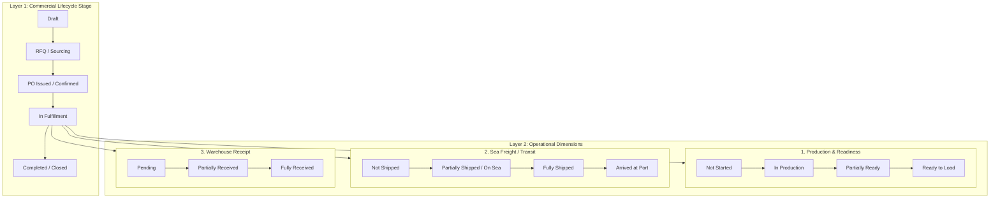
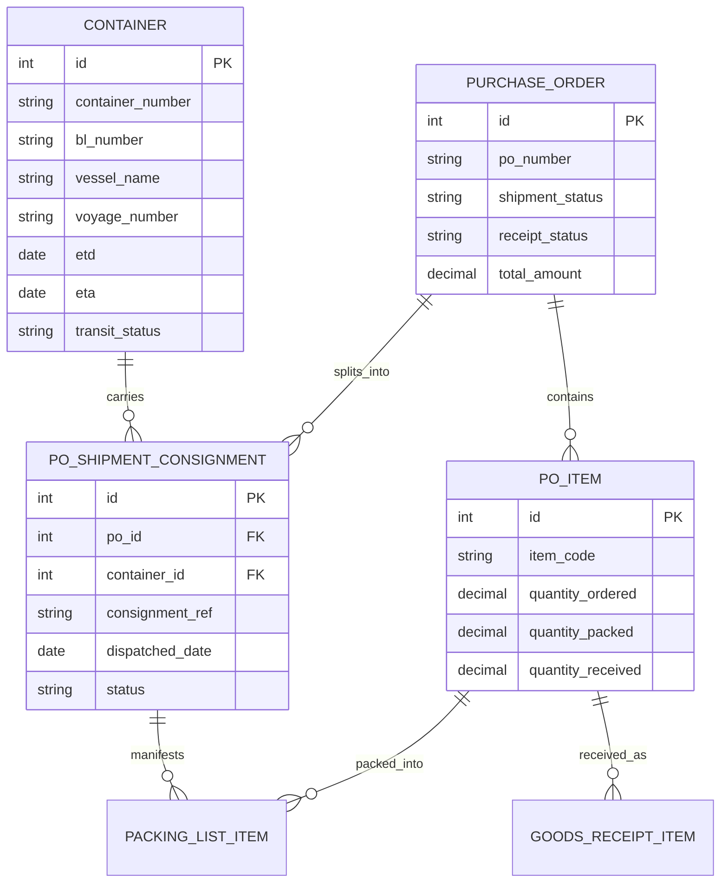

# Architectural Specification: Multi-Consignment & Partial Fulfillment Engine

**System**: FreightLens / Seychelles Sahaj ERP  
**Scope**: Purchase Orders, Partial Readiness, Multi-Container Sea Freight & Split Warehouse Receipts  
**Status**: Proposal / Blueprint for Future Implementation  

---

## 1. Executive Summary & Problem Statement

In international maritime supply chains (e.g. imports into Seychelles from China, India, Europe, South Africa), procurement orders rarely move as single monolithic batches:
- A single Purchase Order (PO) frequently contains dozens of distinct line items or thousands of units.
- **Partial Production / Readiness**: Suppliers complete manufacturing in stages. 50% of the goods may be ready for container stuffing at origin ports (e.g. Ningbo, Nhava Sheva) while the remaining 50% is still in production.
- **Split Shipments (Sea Way)**: Part of the order departs on Vessel A (Container 1), while the rest departs 3 weeks later on Vessel B (Container 2). Marking an entire PO as simply "ON SEA" or "SHIPPED" creates operational confusion, misleading accounting and logistics teams.
- **Split Warehouse Receipts**: Container 1 arrives at the Port of Victoria (Mahe) and is cleared and received into inventory, while backorders remain in transit or at the factory.

This document establishes the architecture for a **Dual-Layer Multi-Consignment Tracking Engine** that deterministically calculates:
1. **Partial Readiness** (`NOT_STARTED` -> `IN_PRODUCTION` -> `PARTIALLY_READY` -> `READY_TO_LOAD`)
2. **Partial Sea Freight** (`NOT_SHIPPED` -> `PARTIALLY_SHIPPED` / `ON_SEA` -> `FULLY_SHIPPED`)
3. **Partial Warehouse Receipts** (`PENDING` -> `PARTIALLY_RECEIVED` -> `FULLY_RECEIVED`)

---

## 2. Dual-Layer Status Architecture

Modern enterprise ERP systems (SAP S/4HANA, NetSuite, Dynamics 365) decouple **Commercial Contract Milestones** from **Physical Logistics Execution**.



### Layer 1: Commercial Lifecycle Stage (Macro)
Reflects the contractual stage of the order:
- `DRAFT`: Internal requisition or order creation.
- `SOURCING` / `RFQ`: Vendor quotation gathering.
- `PO_ISSUED`: Formal binding purchase order placed with the supplier.
- `IN_FULFILLMENT`: Goods are being manufactured, shipped, or delivered.
- `COMPLETED`: 100% of goods received and financial reconciliation closed.
- `CANCELLED`: Order annulled.

### Layer 2: Independent Physical Tracking Dimensions (Micro)
These reflect real-world physical goods movement:
1. **`production_status`**: Physical readiness at the supplier's warehouse/factory.
2. **`shipment_status`**: Physical departure and sea transit status.
3. **`receipt_status`**: Physical arrival, customs clearance, and warehouse stocking.
4. **`payment_status`**: Financial settlement (`NONE`, `ADVANCE_PAID`, `PART_PAID`, `FULLY_PAID`).

---

## 3. Mathematical State Determination (Zero Manual Guesswork)

Status transitions should **never be manually entered** as subjective dropdown selections. They are computed deterministically from line item quantities and container packing records.

### 3.1 Line-Item Level Quantities
Every line item in `containermgmt.po_items` maintains:
- $Q_{\text{ordered}}$: Confirmed PO quantity.
- $Q_{\text{ready}}$: Inspected & packed quantity ready at origin factory.
- $Q_{\text{packed}}$ ($Q_{\text{shipped}}$): Quantity assigned to active Bills of Lading / Containers.
- $Q_{\text{received}}$: Quantity verified through Warehouse Goods Receipt Notes (GRN).
- $Q_{\text{balance}} = \max(0, Q_{\text{ordered}} - Q_{\text{received}})$.

### 3.2 Order-Level Aggregation Formulas
For a purchase order with $N$ active line items:

$$\text{Total Ordered} = \sum_{i=1}^N Q_{\text{ordered}, i}$$

$$\text{Total Shipped} = \sum_{i=1}^N Q_{\text{shipped}, i}$$

$$\text{Total Received} = \sum_{i=1}^N Q_{\text{received}, i}$$

$$\text{Shipment Percentage} = \left( \frac{\text{Total Shipped}}{\text{Total Ordered}} \right) \times 100\%$$

$$\text{Receipt Percentage} = \left( \frac{\text{Total Received}}{\text{Total Ordered}} \right) \times 100\%$$

---

### 3.3 State Machine Decision Matrix

#### A. Shipment & Sea Way State (`shipment_status`)
| Condition | Computed Status | Visual Label & UX Badge |
| :--- | :--- | :--- |
| $\text{Total Shipped} = 0$ | `NOT_SHIPPED` | `Not Shipped (0%)` |
| $0 < \text{Total Shipped} < \text{Total Ordered}$ | **`PARTIALLY_SHIPPED`** | **`Partially On Sea (X%)`** *(Amber Badge)* |
| $\text{Total Shipped} \ge \text{Total Ordered}$ | `FULLY_SHIPPED` | `Fully Shipped (100%)` *(Blue Badge)* |
| All linked containers marked `ARRIVED` | `ARRIVED_PORT` | `Arrived Port Victoria` *(Emerald Badge)* |

#### B. Warehouse Receipt State (`receipt_status`)
| Condition | Computed Status | Visual Label & UX Badge |
| :--- | :--- | :--- |
| $\text{Total Received} = 0$ | `PENDING` | `Unreceived (0%)` |
| $0 < \text{Total Received} < \text{Total Ordered}$ | **`PARTIALLY_RECEIVED`** | **`Partially Received (Y%)`** *(Amber Badge)* |
| $\text{Total Received} \ge \text{Total Ordered}$ | `FULLY_RECEIVED` | `Fully Received (100%)` *(Emerald Badge)* |

#### C. Order Auto-Completion
When:
$$\text{receipt\_status} = \text{FULLY\_RECEIVED} \quad \text{AND} \quad \text{payment\_status} = \text{FULLY\_PAID}$$
The Purchase Order's macro lifecycle automatically advances to **`COMPLETED`**.

---

## 4. Multi-Container & Bill of Lading (B/L) Data Architecture

To support splitting 1 PO across multiple containers:



### 4.1 Real-World Example
**Purchase Order**: `PO-2026-0045` (Foshan Ceramics Co.)  
- Item 1: 1,000 SQM Polished Porcelain Tiles
- Item 2: 300 Bags Tile Adhesive
- Item 3: 50 Sets Sanitary Ware

**Split Execution**:
1. **Shipment 1 (Container `MSKU9021443`, B/L `MEDU099182`)**:
   - 600 SQM Porcelain Tiles (60%)
   - 300 Bags Tile Adhesive (100%)
   - *Transit*: Departed Ningbo 12-Sep, ETA Mahe 04-Oct.
   - *PO Status Contribution*: **`PARTIALLY_SHIPPED` (65% Volume On Sea)**.

2. **Shipment 2 (Container `CMAU8812301`, B/L `CMAU551029`)**:
   - 400 SQM Porcelain Tiles (remaining 40%)
   - 50 Sets Sanitary Ware (100%)
   - *Transit*: Factory loading scheduled 28-Sep.

---

## 5. UI / UX Design Specifications

### 5.1 Orders Table / Grid Visual Card
Instead of a single misleading badge, the order card presents a clean dual progress indicator:

```
┌─────────────────────────────────────────────────────────────────────────────┐
│ PO-2026-0045 • Foshan Ceramics Co.                  [ IN FULFILLMENT ]      │
│ Required: 1,350 Units  •  $42,800.00 USD                                    │
├─────────────────────────────────────────────────────────────────────────────┤
│ Sea Freight Progress:                                                       │
│ [████████████████░░░░░░░░░░] 65% Shipped (Shipment 1 of 2 on Vessel MSC Grace)│
│                                                                             │
│ Warehouse Receipt Progress:                                                 │
│ [░░░░░░░░░░░░░░░░░░░░░░░░░░] 0% Received (Pending Port Arrival 04-Oct)      │
└─────────────────────────────────────────────────────────────────────────────┘
```

### 5.2 Line-Item High-Density ERP Table
Columns inside the Order Details workspace:

| # | SKU / Item Code | Description | Ordered | Shipped (Sea) | Received (Whs) | Balance Due | Item Fulfillment Status |
| :-: | :--- | :--- | :---: | :---: | :---: | :---: | :--- |
| 1 | `TIL-POR-01` | Polished Porcelain Tiles 60x60 | 1,000 SQM | 600 SQM | 0 SQM | 400 SQM | 🟨 **Partially Shipped (60%)** |
| 2 | `ADH-EXT-20` | Waterproof Tile Adhesive 20kg | 300 BGS | 300 BGS | 0 BGS | 0 BGS | 🟦 **Fully Shipped (100%)** |
| 3 | `SAN-SET-05` | Ceramic Toilet & Basin Suite | 50 SET | 0 SET | 0 SET | 50 SET | ⬜ **Awaiting Factory Dispatch** |

### 5.3 Linked Containers / Shipments Tab
An expandable accordion underneath the line items list:
- **Consignment 1** (`MSKU9021443` • 40ft HQ): 
  - Status: *In Transit (Vessel: MSC Grace 2404W, ETA: 04-Oct-2026)*
  - Items Packed: 600 SQM Tiles, 300 Bags Adhesive.
  - Action: [View B/L & Container Tracking]
- **Consignment 2** (Pending Container Assignment):
  - Status: *Awaiting Origin Booking*
  - Items Pending: 400 SQM Tiles, 50 Sets Sanitary Ware.
  - Action: [+ Assign to Container]

---

## 6. Implementation Roadmap

When approved for development, the implementation breaks down into 3 discrete phases:

### Phase 1: Database & Backend Calculation Engine
1. Verify `POItem` quantity tracking columns (`quantity_ordered`, `quantity_packed`, `quantity_received`).
2. Add automated calculation hook on PO fetch: compute `shipment_pct`, `receipt_pct`, and derive dynamic statuses (`PARTIALLY_SHIPPED`, `PARTIALLY_RECEIVED`).
3. Add backend endpoint `GET /orders/{id}/fulfillment-summary` returning progress breakdowns.

### Phase 2: Multi-Consignment Container Linking
1. Link `containermgmt.packing_list_items` directly with `containermgmt.containers` and `po_items`.
2. Automatically update `po_item.quantity_packed` whenever items are checked into a container packing list.
3. Automatically update `po_item.quantity_received` whenever a container is unloaded through warehouse GRN.

### Phase 3: Frontend UI Components
1. Create reusable `FulfillmentProgressBar` component showing ordered vs shipped vs received with tooltips.
2. Update `OrderTable.js` and `OrderCardGrid.js` to render the dual progress pills.
3. Add the **Consignments & Containers** tracking sub-panel inside `OrderEntryPage.js`.

---

*Document compiled for FreightLens Core Architecture. Ready for milestone planning.*
