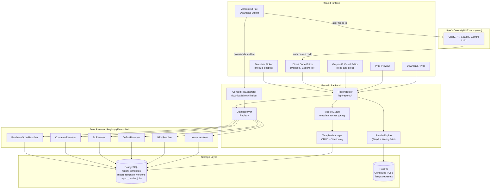
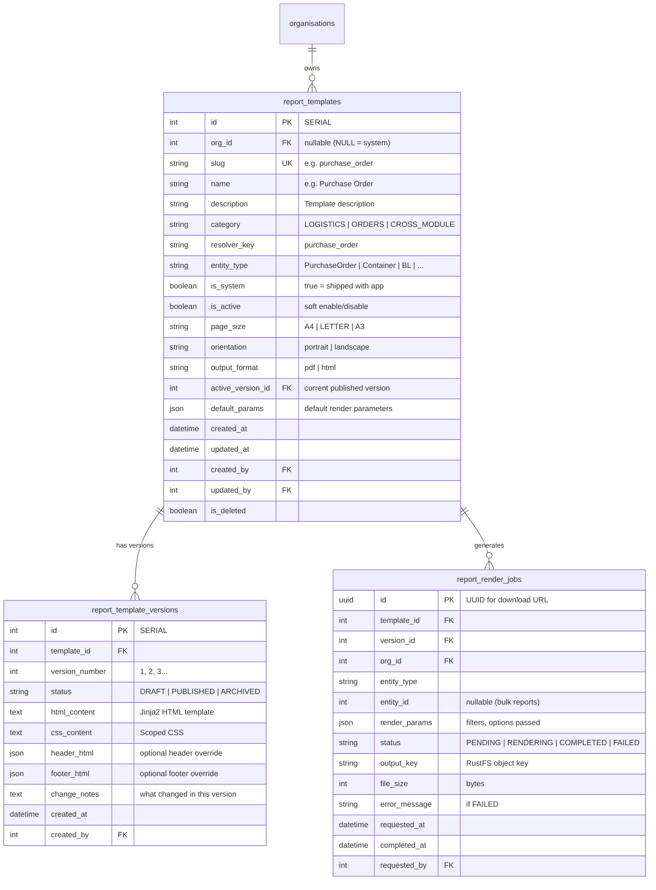

# FreightLens — Report & Print Template System
## Complete Architecture & Implementation Plan

> **Version**: 2.0 — 26 Sep 2026  
> **Module Key**: `REPORTS`  
> **Status**: PLAN — Awaiting Approval

---

## Table of Contents

1. [Executive Summary](#1-executive-summary)
2. [Requirements Analysis](#2-requirements-analysis)
3. [System Architecture](#3-system-architecture)
4. [Database Design](#4-database-design)
5. [Data Resolver Architecture](#5-data-resolver-architecture)
6. [Template Engine & Rendering Pipeline](#6-template-engine--rendering-pipeline)
7. [API Design](#7-api-design)
8. [Security Model](#8-security-model)
9. [AI Context File System](#9-ai-context-file-system)
10. [Frontend Architecture](#10-frontend-architecture)
11. [Module-Scoped Access & Future Extensibility](#11-module-scoped-access--future-extensibility)
12. [Infrastructure & Deployment](#12-infrastructure--deployment)
13. [Performance & Scalability Strategy](#13-performance--scalability-strategy)
14. [Testing Strategy](#14-testing-strategy)
15. [Phased Implementation Plan](#15-phased-implementation-plan)
16. [File Manifest](#16-file-manifest)
17. [Risk Register](#17-risk-register)

---

## 1. Executive Summary

### What
A self-hosted, extensible document generation system embedded within FreightLens that allows:
- **System-provided templates**: Pre-built templates for standard documents (PO, Invoice, Packing List, Damage Report, BL Summary, etc.)
- **Customer-configurable templates**: Tenants can create/modify their own report templates with branding, custom fields, and layout
- **Two editing modes**:
  - **Direct Code Editor** — For knowledgeable users: paste or write Jinja2/HTML/CSS directly, with real-time validation
  - **GrapesJS Visual Editor** — For non-technical users: drag-and-drop builder (has limitations compared to manual code)
- **PDF & Print output**: HTML/CSS → PDF rendering via WeasyPrint (Phase 1), Playwright/Chromium (future)
- **AI Context File (downloadable, NOT integrated)**: Users download a context file that documents available data fields, template structure, example code, and rendering logic. They feed this file to their own AI (ChatGPT, Claude, Gemini, etc.), get template code back, and paste it into the Direct Code Editor. **No AI is embedded in our system.**
- **Module-scoped access**: Template access follows module access — ORDERS module users see ORDER templates and get ORDER entity pickers; users without a module must type references manually
- **Future-extensible**: Designed so new modules (e.g., WAREHOUSE, FLEET, FINANCE) can register their own resolvers and templates without modifying the core engine

### Why
Currently, report generation is fragmented:
- [reportGenerator.py](file:///d:/WorkPlace/Seychelles_Sahaj/Backend/Utils/reportGenerator.py) uses WeasyPrint with hardcoded HTML strings
- [damage_report.html](file:///d:/WorkPlace/Seychelles_Sahaj/Backend/templates/report/damage_report.html) is a static Jinja2 template
- No tenant customization, no versioning, no template management UI
- Every new report type requires developer intervention and code deployment

### Design Principles
1. **Evolve without rewrite** — Clean abstraction boundaries between resolvers, templates, and renderers
2. **Don't overengineer V1** — Start with Jinja2 + WeasyPrint, upgrade renderer later
3. **Treat customer templates as untrusted** — Sandboxed Jinja2 environment, no arbitrary code execution
4. **Multi-tenant from day one** — `OrgMixin` on all template tables, org_id filtering everywhere
5. **Performance at scale** — Async rendering queue, caching, pagination
6. **Module-scoped resources** — Template access, entity pickers, and data resolvers are gated by the user's module subscriptions
7. **AI-agnostic** — We provide the context; the user chooses their own AI tool

---

## 2. Requirements Analysis

### 2.1 Existing Report Touchpoints in FreightLens

| Document | Current Implementation | Data Source |
|---|---|---|
| Damage/Defect Report | `generate_defect_report_pdf()` in `reportGenerator.py` — hardcoded HTML | `DefectReport` + `DefectItem` + `ContainerDetails` + `PurchaseOrder` |
| Damage Report (Jinja2) | `generate_damage_report_pdf()` — loads `damage_report.html` | Dict with `container_number`, `report_date`, `products[]` |
| Purchase Order PDF | ❌ Not implemented | `PurchaseOrder` + `POItem` + `Supplier` + `Consignee` |
| Proforma Invoice | ❌ Not implemented | `PurchaseOrder` + `POItem` + `Supplier` + financial fields |
| Bill of Lading Summary | ❌ Not implemented | `BillOfLanding` + `ContainerDetails[]` + `Supplier` + `Consignee` |
| Packing List | ❌ Not implemented | `OrderPackingList` + `PackingListItem[]` |
| Goods Receipt Note (GRN) | ❌ Not implemented | `GoodsReceipt` + `ReceiptItem[]` + `PurchaseOrder` |
| Container Register Export | ❌ Not implemented | `ContainerDetails[]` with demurrage calculations |
| Store Request | ❌ Not implemented | `StoreRequest` + `StoreRequestItem[]` |

### 2.2 Target Report Categories

```
SYSTEM_TEMPLATES (shipped with FreightLens, non-deletable):
├── LOGISTICS Module
│   ├── container_register_export    # Filtered container list export
│   ├── bl_summary                   # Bill of Lading with container list
│   ├── container_damage_report      # Existing, migrated
│   └── demurrage_report             # D&D status per container
│
├── ORDERS Module
│   ├── purchase_order               # Standard PO document
│   ├── proforma_invoice             # PI for supplier confirmation
│   ├── packing_list                 # Supplier packing list
│   ├── goods_receipt_note           # GRN with discrepancy summary
│   ├── store_request                # Internal material request
│   ├── defect_report                # Existing, migrated
│   └── rfq_document                 # Request for Quotation
│
└── CROSS-MODULE
    ├── custom_report                # Blank template for custom use
    └── label_template               # Product/package labels
```

### 2.3 Customer Customization Scope

| What customers CAN customize | What they CANNOT do |
|---|---|
| Logo, company name, header/footer | Execute Python/SQL/shell commands |
| Column visibility & ordering | Access data outside their org_id |
| Color scheme & fonts | Import external JavaScript |
| Custom text blocks & notes | Override system template logic |
| Conditional sections (show/hide) | Delete system-provided templates |
| Date/number formatting | Access other tenant templates |
| Page size & orientation | Bypass financial field restrictions |
| Paste AI-generated code into Direct Code Editor | Use AI integrated inside our system |
| Use GrapesJS Visual Editor for simpler layouts | Override sandbox security restrictions |

### 2.4 Template Editing Modes

| Mode | Target User | Capabilities | Limitations |
|---|---|---|---|
| **Direct Code Editor** | Developers, power users, AI-assisted users | Full Jinja2/HTML/CSS control, conditional logic, loops, complex layouts | Requires HTML/CSS knowledge |
| **GrapesJS Visual Editor** | Non-technical admins, marketing teams | Drag-and-drop blocks, WYSIWYG text, image placement | Cannot create complex conditional logic, limited loop control, simpler layouts only |
| **AI Context File → External AI → Paste Code** | Any user with AI access | AI generates complete template code based on our context file | Requires copy-paste workflow; user validates before saving |

> [!IMPORTANT]
> **Both modes output the same artifact** — a Jinja2 HTML template + CSS. The Visual Editor serializes its blocks into Jinja2-compatible HTML. A template created in Code Editor can be opened in Visual Editor (with potential fidelity loss for advanced constructs), and vice versa.

### 2.5 Module-Scoped Template Access

Template access inherits from the user's module subscription and permissions:

```
User has ORDERS module → Can see/use ORDER templates → Gets ORDER entity picker
                                                       (dropdown of POs, Requests, etc.)

User has LOGISTICS module → Can see/use LOGISTICS templates → Gets LOGISTICS entity picker
                                                               (dropdown of Containers, BLs, etc.)

User has BOTH modules → Sees ALL templates → Gets ALL entity pickers

User has ORDERS but NOT LOGISTICS → ORDER template that references a container_no:
                                     → User must TYPE the container number manually
                                     → No autocomplete/dropdown (data may be inconsistent)
```

**Why this matters**: If a user creates a Purchase Order template that includes a field like `container_no`, but they don't have LOGISTICS module access, they won't get a container selector — they'd have to type it manually, which could lead to inconsistent data. This is acceptable; the system shouldn't grant data access the user doesn't have.

### 2.6 Future Module Extensibility

The system is designed so that when new modules are added (e.g., `WAREHOUSE`, `FLEET`, `FINANCE`, `HR`):

1. **New resolvers register themselves** via `@register_resolver("new_entity")` — no core engine changes
2. **New system templates are added** via the migration seeder — automatic on deployment
3. **Module guard gates access** — templates tagged with the new module category appear only for subscribed tenants
4. **Entity pickers extend** — the frontend `EntitySelector` component dynamically loads available entities based on the user's module access
5. **AI Context File auto-updates** — the downloadable context file is generated dynamically, always reflecting current resolvers and field schemas

---

## 3. System Architecture

### 3.1 High-Level Architecture



### 3.2 Core Components

| Component | Responsibility | Location |
|---|---|---|
| **ReportRouter** | API endpoints for template CRUD, rendering, preview | `Routes/Reports/ReportRouter.py` |
| **TemplateManager** | Template lifecycle (create, version, clone, publish) | `Services/report_template_service.py` |
| **DataResolverRegistry** | Maps `resolver_key` → resolver function; validates available fields. **Extensible** — new modules register resolvers via decorator | `Services/report_data_resolvers.py` |
| **RenderEngine** | Jinja2 compilation + WeasyPrint PDF generation | `Services/report_render_engine.py` |
| **TemplateValidator** | Validates Jinja2 syntax, checks for forbidden constructs | `Services/report_template_validator.py` |
| **ContextFileGenerator** | Dynamically generates downloadable AI context files per resolver | `Services/report_context_generator.py` |

### 3.3 Request Flow (Render a Report)

```
1. Frontend POST /api/reports/render
   Body: { template_id, entity_type, entity_id, params: {}, format: "pdf" }
   
2. ReportRouter receives request
   → Authenticates user (JWT)
   → Checks MODULE access: template.category must match user's subscribed modules
     (e.g., ORDERS template requires ORDERS module access)
   → Validates template_id belongs to user's org (or is a system template)
   
3. TemplateManager loads the template
   → Fetches active version's HTML/CSS from report_template_versions
   → Fetches resolver_key from report_templates
   
4. DataResolverRegistry dispatches to the correct resolver
   → PurchaseOrderResolver(entity_id, org_context, user) → dict
   → Applies org_id filter on ALL queries
   → Applies permission-based field redaction (financial fields, vendor fields)
   → Returns a flat context dict: { po_number, supplier_name, items: [...], ... }
   
5. RenderEngine compiles and renders
   → SandboxedEnvironment.from_string(template_html)
   → template.render(context_dict)
   → WeasyPrint(html_string).write_pdf()
   
6. Response
   → Stream PDF bytes with Content-Disposition
   → OR save to RustFS and return download URL
```

### 3.4 Template Creation Flow (User with AI)

```
1. User opens Template Editor → clicks "Download AI Context File"
   → System generates a comprehensive .md file containing:
     • All available data fields for the selected resolver
     • Which fields are permission-gated (financial, vendor)
     • Jinja2 syntax guide with FreightLens-specific examples
     • CSS guidelines for PDF rendering (page breaks, margins)
     • Example templates (working code they can modify)
     • Forbidden patterns (what NOT to include)

2. User opens their preferred AI tool (ChatGPT, Claude, etc.)
   → Pastes the context file content
   → Describes what they want: "Create a purchase order template with our logo, 
     show items in a table, include payment terms at the bottom"

3. AI generates Jinja2/HTML/CSS code

4. User copies the AI output → pastes into Direct Code Editor
   → System validates in real-time (forbidden patterns, syntax)
   → User sees live preview
   → User saves as draft → publishes when satisfied

Alternative: User uses GrapesJS Visual Editor for simpler templates
  → Drag-and-drop blocks for tables, headers, text
  → Limited compared to Direct Code but no coding needed
```

---

## 4. Database Design

### 4.1 Entity Relationship Diagram



### 4.2 SQLAlchemy Models

#### `ReportTemplate` — `Model/containermgmt/Report/ReportTemplate.py`

```python
class ReportTemplate(OrgMixin, AuditMixin, Base):
    __tablename__ = "report_templates"
    __table_args__ = (
        UniqueConstraint("org_id", "slug", name="uq_report_templates_org_slug"),
        {"schema": "containermgmt"},
    )

    id = Column(Integer, primary_key=True, autoincrement=True)
    slug = Column(String(100), nullable=False, index=True)
    name = Column(String(255), nullable=False)
    description = Column(Text, nullable=True)
    category = Column(String(50), nullable=False, index=True)  # LOGISTICS, ORDERS, CROSS_MODULE
    resolver_key = Column(String(100), nullable=False, index=True)  # maps to DataResolverRegistry
    entity_type = Column(String(100), nullable=False)  # PurchaseOrder, ContainerDetails, etc.
    is_system = Column(Boolean, default=False, nullable=False)
    is_active = Column(Boolean, default=True, nullable=False)
    page_size = Column(String(20), default="A4")
    orientation = Column(String(20), default="portrait")
    output_format = Column(String(10), default="pdf")
    active_version_id = Column(Integer, nullable=True)  # FK set after version creation
    default_params = Column(JSON, nullable=True)

    # Relationships
    versions = relationship("ReportTemplateVersion", back_populates="template",
                           cascade="all, delete-orphan", order_by="ReportTemplateVersion.version_number.desc()")
    render_jobs = relationship("ReportRenderJob", back_populates="template")
```

#### `ReportTemplateVersion` — `Model/containermgmt/Report/ReportTemplateVersion.py`

```python
class ReportTemplateVersion(AuditMixin, Base):
    __tablename__ = "report_template_versions"
    __table_args__ = (
        UniqueConstraint("template_id", "version_number", name="uq_template_version"),
        {"schema": "containermgmt"},
    )

    id = Column(Integer, primary_key=True, autoincrement=True)
    template_id = Column(Integer, ForeignKey("containermgmt.report_templates.id", ondelete="CASCADE"),
                        nullable=False, index=True)
    version_number = Column(Integer, nullable=False, default=1)
    status = Column(String(20), default="DRAFT", index=True)  # DRAFT, PUBLISHED, ARCHIVED
    html_content = Column(Text, nullable=False)
    css_content = Column(Text, nullable=True)
    header_html = Column(Text, nullable=True)
    footer_html = Column(Text, nullable=True)
    change_notes = Column(Text, nullable=True)

    # Relationships
    template = relationship("ReportTemplate", back_populates="versions")
```

#### `ReportRenderJob` — `Model/containermgmt/Report/ReportRenderJob.py`

```python
class ReportRenderJob(Base):
    __tablename__ = "report_render_jobs"
    __table_args__ = {"schema": "containermgmt"}

    id = Column(UUID(as_uuid=False), primary_key=True, default=lambda: str(uuid.uuid4()))
    template_id = Column(Integer, ForeignKey("containermgmt.report_templates.id"), nullable=False, index=True)
    version_id = Column(Integer, ForeignKey("containermgmt.report_template_versions.id"), nullable=True)
    org_id = Column(Integer, ForeignKey("usercredentials.organisations.id"), nullable=False, index=True)
    entity_type = Column(String(100), nullable=True)
    entity_id = Column(Integer, nullable=True, index=True)
    render_params = Column(JSON, nullable=True)
    status = Column(String(20), default="PENDING", index=True)
    output_key = Column(String(500), nullable=True)  # RustFS object key
    file_size = Column(Integer, nullable=True)
    error_message = Column(Text, nullable=True)
    requested_at = Column(DateTime(timezone=True), server_default=func.now(), nullable=False)
    completed_at = Column(DateTime(timezone=True), nullable=True)
    requested_by = Column(Integer, ForeignKey("usercredentials.users.id"), nullable=False)

    # Relationships
    template = relationship("ReportTemplate", back_populates="render_jobs")
    requester = relationship("User", foreign_keys=[requested_by], viewonly=True)
```

### 4.3 Migration Script — `Utils/migrate_report_templates.py`

Idempotent migration that:
1. Creates `report_templates` table if not exists
2. Creates `report_template_versions` table if not exists
3. Creates `report_render_jobs` table if not exists
4. Adds unique constraint on `(org_id, slug)`
5. Adds indexes on `category`, `resolver_key`, `status`
6. Seeds system templates (Phase 1 defaults)

Registration in [containerMgmt.py](file:///d:/WorkPlace/Seychelles_Sahaj/Backend/containerMgmt.py):
```python
from Utils.migrate_report_templates import ensure_report_templates_schema
ensure_report_templates_schema()
```

---

## 5. Data Resolver Architecture

### 5.1 Design Pattern — Registry + Protocol

Each resolver is a function that:
1. Accepts `(entity_id, db, org_context, user)` 
2. Queries the database with **org_id filtering** and **permission-aware field selection**
3. Returns a **flat dictionary** that becomes the Jinja2 template context

```python
# Services/report_data_resolvers.py

from typing import Protocol, Dict, Any, Optional, Callable
from sqlalchemy.orm import Session
from Utils.org_filter import OrgContext
from Model.Credentials.users import User

# Type alias for a resolver function
ResolverFn = Callable[[int, Session, OrgContext, User, Optional[dict]], Dict[str, Any]]

# Registry mapping resolver_key → resolver function
_RESOLVER_REGISTRY: Dict[str, ResolverFn] = {}

def register_resolver(key: str):
    """Decorator to register a data resolver."""
    def decorator(fn: ResolverFn):
        _RESOLVER_REGISTRY[key] = fn
        return fn
    return decorator

def get_resolver(key: str) -> ResolverFn:
    if key not in _RESOLVER_REGISTRY:
        raise ValueError(f"Unknown report resolver: '{key}'")
    return _RESOLVER_REGISTRY[key]

def list_resolvers() -> list:
    return list(_RESOLVER_REGISTRY.keys())
```

### 5.2 Example Resolvers

#### Purchase Order Resolver

```python
@register_resolver("purchase_order")
def resolve_purchase_order(entity_id, db, org_context, user, params=None):
    from Model.containermgmt import PurchaseOrder, POItem
    from auth.security_guards import is_financial_user, can_view_supplier_user
    
    po = db.query(PurchaseOrder).filter(
        PurchaseOrder.id == entity_id,
        PurchaseOrder.org_id.in_(org_context.allowed_org_ids),
        PurchaseOrder.is_deleted == False,
    ).first()
    
    if not po:
        raise HTTPException(404, "Purchase order not found")
    
    can_financial = is_financial_user(user)
    can_vendor = can_view_supplier_user(user)
    
    items = []
    for item in po.items:
        if item.is_deleted:
            continue
        row = {
            "description": item.description,
            "quantity": float(item.quantity or 0),
            "unit": item.unit or "PCS",
            "sku": item.sku,
        }
        if can_financial:
            row["unit_price"] = float(item.unit_price or 0)
            row["total_price"] = float(item.total_price or 0)
            row["currency"] = po.currency or "USD"
        items.append(row)
    
    context = {
        # Header
        "po_number": po.po_number,
        "po_date": str(po.created_at.date()) if po.created_at else "",
        "status": po.status,
        "lifecycle_stage": po.lifecycle_stage,
        "eta_date": str(po.eta_date) if po.eta_date else "",
        "remark": po.remark or "",
        "freight_type": po.freight_type or "Sea Freight",
        
        # Items
        "items": items,
        "item_count": len(items),
        
        # Organisation
        "org_name": org_context.current_org_id,  # resolved to name
        "report_date": datetime.utcnow().strftime("%Y-%m-%d"),
        "generated_by": user.username,
    }
    
    # Financial fields (redacted if not authorized)
    if can_financial:
        context["total_amount"] = float(po.total_amount or 0)
        context["advance_amount"] = float(po.advance_amount or 0)
        context["balance_amount"] = float(po.balance_amount or 0)
        context["currency"] = po.currency or "USD"
        context["show_financials"] = True
    else:
        context["show_financials"] = False
    
    # Vendor fields (redacted if not authorized)
    if can_vendor and po.supplier_rel:
        context["supplier_name"] = po.supplier_rel.SupplierName or ""
        context["supplier_address"] = getattr(po.supplier_rel, "Address", "") or ""
        context["supplier_email"] = getattr(po.supplier_rel, "Email", "") or ""
        context["show_vendor"] = True
    else:
        context["show_vendor"] = False
    
    return context
```

#### Container / Defect Resolver (migrates existing logic)

```python
@register_resolver("defect_report")
def resolve_defect_report(entity_id, db, org_context, user, params=None):
    from Model.containermgmt import DefectReport
    
    d = db.query(DefectReport).filter(
        DefectReport.id == entity_id,
        DefectReport.org_id.in_(org_context.allowed_org_ids),
        DefectReport.is_deleted == False,
    ).first()
    
    if not d:
        raise HTTPException(404, "Defect report not found")
    
    items = []
    for idx, it in enumerate(d.items or [], 1):
        if not it.is_deleted:
            items.append({
                "index": idx,
                "description": it.item_description,
                "quantity": f"{it.quantity_affected or 1} {it.unit or 'PCS'}",
                "notes": it.notes or "—",
            })
    
    return {
        "defect_number": d.defect_number,
        "title": d.title or "Defect Details",
        "description": d.description or "",
        "status": d.status,
        "report_type": "Receiving Defect" if d.report_type == "GOODS_DEFECT" else "Container Damage",
        "discovery_date": str(d.discovery_date or ""),
        "container_no": d.container.container_no if d.container else "—",
        "po_number": d.purchase_order.po_number if d.purchase_order else "—",
        "bl_number": d.bill_of_lading_no or "—",
        "items": items,
        "resolution_type": d.resolution_type or "",
        "resolution_notes": d.resolution_notes or "",
        "is_resolved": d.status == "RESOLVED",
        "report_date": datetime.utcnow().strftime("%Y-%m-%d"),
        "generated_by": user.username,
    }
```

### 5.3 Full Resolver Inventory (Phase 1)

| Resolver Key | Entity Model | Data Fields |
|---|---|---|
| `purchase_order` | `PurchaseOrder` + `POItem` + `Supplier` | PO header, line items, financials (gated), vendor (gated) |
| `defect_report` | `DefectReport` + `DefectItem` | Defect details, affected items, resolution |
| `goods_receipt_note` | `GoodsReceipt` + `ReceiptItem` | GRN header, line items, discrepancies |
| `bl_summary` | `BillOfLanding` + `ContainerDetails[]` | BL header, container list, status, free days |
| `container_register` | `ContainerDetails[]` (paginated) | Container list with demurrage calculations |
| `store_request` | `StoreRequest` + `StoreRequestItem[]` | Request header, requested items |
| `packing_list` | `OrderPackingList` + `PackingListItem[]` | Packing list header, items, weights |

---

## 6. Template Engine & Rendering Pipeline

### 6.1 Jinja2 Sandboxed Environment

```python
# Services/report_render_engine.py

from jinja2.sandbox import SandboxedEnvironment, ImmutableSandboxedEnvironment
from jinja2 import BaseLoader, TemplateNotFound
from weasyprint import HTML
import logging

logger = logging.getLogger("containerMgmt.report_engine")

# Allowed global functions in templates (safe, read-only)
TEMPLATE_GLOBALS = {
    "now": lambda: datetime.utcnow().strftime("%Y-%m-%d %H:%M"),
    "format_date": lambda d, fmt="%d %b %Y": d.strftime(fmt) if d else "—",
    "format_number": lambda n, decimals=2: f"{n:,.{decimals}f}" if n else "0",
    "format_currency": lambda amount, currency="USD": f"{currency} {amount:,.2f}" if amount else "",
}

# BLOCKED: These are explicitly removed from the sandbox
BLOCKED_ATTRS = {
    "__import__", "__builtins__", "eval", "exec", "compile",
    "open", "os", "sys", "subprocess", "importlib",
}

class StringLoader(BaseLoader):
    """Loads templates from a raw string (database-stored template)."""
    def __init__(self, html_content):
        self.html_content = html_content
    
    def get_source(self, environment, template):
        if template == "report":
            return self.html_content, "report", lambda: True
        raise TemplateNotFound(template)

def create_sandboxed_env(html_content: str, css_content: str = "") -> SandboxedEnvironment:
    env = ImmutableSandboxedEnvironment(
        loader=StringLoader(html_content),
        autoescape=True,
        extensions=["jinja2.ext.loopcontrols"],
    )
    env.globals.update(TEMPLATE_GLOBALS)
    return env

def render_html(template_html: str, template_css: str, context: dict,
                header_html: str = None, footer_html: str = None) -> str:
    """Renders a Jinja2 template to final HTML string."""
    env = create_sandboxed_env(template_html)
    template = env.get_template("report")
    body_html = template.render(**context)
    
    # Compose full HTML document
    full_html = f"""<!DOCTYPE html>
<html>
<head>
    <meta charset="UTF-8">
    <style>
        @page {{
            size: {context.get('_page_size', 'A4')} {context.get('_orientation', 'portrait')};
            margin: 15mm 12mm 20mm 12mm;
            @top-center {{ content: element(header); }}
            @bottom-center {{ content: element(footer); }}
        }}
        .page-header {{ position: running(header); }}
        .page-footer {{ position: running(footer); }}
        {template_css or ''}
    </style>
</head>
<body>
    {f'<div class="page-header">{header_html}</div>' if header_html else ''}
    {body_html}
    {f'<div class="page-footer">{footer_html}</div>' if footer_html else ''}
</body>
</html>"""
    return full_html

def render_pdf(html_string: str) -> bytes:
    """Converts final HTML to PDF bytes using WeasyPrint."""
    return HTML(string=html_string, base_url=".").write_pdf()
```

### 6.2 Template Validation

```python
# Services/report_template_validator.py

from jinja2 import Environment, TemplateSyntaxError
from jinja2.sandbox import SandboxedEnvironment
import re

FORBIDDEN_PATTERNS = [
    r'\{%\s*import\s',        # 
    r'\{%\s*from\s',          # 
    r'\{\{\s*.*\.__class__',   # {{ obj.__class__ }}
    r'\{\{\s*.*\.__subclasses__', 
    r'\{\{\s*.*\.__mro__',
    r'\{\{\s*.*\.__globals__',
    r'\{\{\s*.*\.__builtins__',
    r'<script',               # No JavaScript
    r'javascript:',           # No JS protocol
    r'on\w+\s*=',             # No event handlers (onclick, onerror, etc.)
]

def validate_template(html_content: str, css_content: str = "") -> dict:
    """
    Validates a template for syntax correctness and security.
    Returns: { "valid": bool, "errors": list[str], "warnings": list[str] }
    """
    errors = []
    warnings = []
    
    # 1. Check for forbidden patterns
    for pattern in FORBIDDEN_PATTERNS:
        if re.search(pattern, html_content, re.IGNORECASE):
            errors.append(f"Forbidden pattern detected: {pattern}")
    
    # 2. Validate Jinja2 syntax
    try:
        env = SandboxedEnvironment()
        env.parse(html_content)
    except TemplateSyntaxError as e:
        errors.append(f"Template syntax error at line {e.lineno}: {e.message}")
    
    # 3. Check CSS for potential issues
    if css_content:
        if "url(" in css_content.lower():
            warnings.append("CSS contains url() references — external resources may not be available during PDF rendering")
        if "position: fixed" in css_content.lower():
            warnings.append("CSS uses position:fixed — this may not render correctly in PDF output")
    
    # 4. Size check
    if len(html_content) > 500_000:  # 500KB
        errors.append("Template HTML exceeds maximum size of 500KB")
    if css_content and len(css_content) > 100_000:  # 100KB
        errors.append("Template CSS exceeds maximum size of 100KB")
    
    return {
        "valid": len(errors) == 0,
        "errors": errors,
        "warnings": warnings,
    }
```

### 6.3 Rendering Pipeline (Phase 1: Synchronous → Phase 2: Async Queue)

#### Phase 1 — Synchronous (Inline)
```
POST /api/reports/render → resolve data → render HTML → WeasyPrint → stream PDF
```
- Simple, immediate response
- Suitable for single-document generation
- Timeout risk for complex reports (mitigated by 60s timeout)

#### Phase 2 — Async Queue (Background)
```
POST /api/reports/render → create ReportRenderJob (PENDING) → return job_id
Background Worker picks up job → resolve → render → upload PDF to RustFS → mark COMPLETED
GET /api/reports/jobs/{job_id} → poll status → download when ready
```
- Uses APScheduler or a dedicated worker
- Required for: bulk exports, large container registers, multi-page reports
- RustFS stores the generated PDF; download URL returned

---

## 7. API Design

### 7.1 Router: `Routes/Reports/ReportRouter.py`

**Prefix**: `/api/reports`  
**Module Guard**: Inherits from parent module (`LOGISTICS` or `ORDERS`) — reports are cross-module  
**Permission**: `View_Report`, `Manage_Report_Template`

| Method | Path | Purpose | Permission |
|---|---|---|---|
| `GET` | `/templates` | List available templates (system + org) | `View_Report` |
| `GET` | `/templates/{id}` | Get template details + active version content | `View_Report` |
| `POST` | `/templates` | Create custom template | `Manage_Report_Template` |
| `PUT` | `/templates/{id}` | Update template metadata | `Manage_Report_Template` |
| `DELETE` | `/templates/{id}` | Soft-delete custom template (system=blocked) | `Manage_Report_Template` |
| `GET` | `/templates/{id}/versions` | List all versions of a template | `View_Report` |
| `POST` | `/templates/{id}/versions` | Create new version (draft) | `Manage_Report_Template` |
| `PUT` | `/templates/{id}/versions/{vid}/publish` | Publish a draft version | `Manage_Report_Template` |
| `POST` | `/templates/validate` | Validate template HTML/CSS | `Manage_Report_Template` |
| `POST` | `/render` | Render a report (sync PDF stream) | `View_Report` |
| `POST` | `/render/preview` | Render HTML preview (no PDF) | `View_Report` |
| `POST` | `/render/async` | Queue async render job | `View_Report` |
| `GET` | `/jobs/{job_id}` | Check render job status | `View_Report` |
| `GET` | `/jobs/{job_id}/download` | Download completed PDF | `View_Report` |
| `GET` | `/resolvers` | List available data resolvers & their fields | `Manage_Report_Template` |
| `GET` | `/resolvers/{key}/schema` | Get resolver field schema | `Manage_Report_Template` |

### 7.2 API Contracts

#### List Templates
```json
// GET /api/reports/templates?category=ORDERS&page=1&limit=25
{
    "items": [
        {
            "id": 1,
            "slug": "purchase_order",
            "name": "Purchase Order",
            "category": "ORDERS",
            "is_system": true,
            "is_active": true,
            "page_size": "A4",
            "orientation": "portrait",
            "active_version": 3,
            "resolver_key": "purchase_order",
            "entity_type": "PurchaseOrder"
        }
    ],
    "total": 12,
    "page": 1,
    "pages": 1,
    "limit": 25
}
```

#### Render Report (Sync)
```json
// POST /api/reports/render
{
    "template_id": 1,
    "entity_type": "PurchaseOrder",
    "entity_id": 42,
    "format": "pdf",
    "params": {
        "show_logo": true,
        "paper_size": "A4"
    }
}
// Response: application/pdf binary stream
```

#### Render Preview (HTML)
```json
// POST /api/reports/render/preview
{
    "template_id": 1,
    "entity_type": "PurchaseOrder",
    "entity_id": 42
}
// Response: { "html": "<html>...</html>" }
```

#### Resolver Schema
```json
// GET /api/reports/resolvers/purchase_order/schema
{
    "resolver_key": "purchase_order",
    "entity_type": "PurchaseOrder",
    "fields": {
        "po_number": { "type": "string", "description": "Purchase order number" },
        "po_date": { "type": "string", "description": "Order creation date" },
        "status": { "type": "string", "description": "Current PO status" },
        "items": {
            "type": "array",
            "item_fields": {
                "description": { "type": "string" },
                "quantity": { "type": "number" },
                "unit_price": { "type": "number", "restricted": true, "permission": "View_Financials" }
            }
        },
        "supplier_name": { "type": "string", "restricted": true, "permission": "View_Supplier" },
        "total_amount": { "type": "number", "restricted": true, "permission": "View_Financials" }
    }
}
```

---

## 8. Security Model

### 8.1 Threat Matrix

| Threat | Mitigation |
|---|---|
| **Template injection (SSTI)** | `ImmutableSandboxedEnvironment` — blocks `__class__`, `__globals__`, `__import__` |
| **Cross-tenant data leak** | Every resolver filters by `org_id`; template table has `org_id` filter |
| **Financial data exposure** | Resolver checks `is_financial_user()` before including price/cost fields |
| **Vendor data exposure** | Resolver checks `can_view_supplier_user()` before including vendor fields |
| **Denial of Service (large template)** | Template size limits: 500KB HTML, 100KB CSS |
| **PDF rendering timeout** | 60-second timeout on WeasyPrint; async queue for large reports |
| **IDOR on render jobs** | `ReportRenderJob.id` is UUID; download requires `org_id` match |
| **JavaScript in templates** | `<script>`, `javascript:`, `on*=` patterns are blocked during validation |
| **Resource exhaustion** | Rate limiting on `/render` endpoints (10 req/min per user) |

### 8.2 Permission Scheme

New permissions to seed in `Utils/seed_rbac_users.py`:

| Permission | Description |
|---|---|
| `View_Report` | Can list templates, render reports, download PDFs |
| `Manage_Report_Template` | Can create/edit/version custom templates |

Role assignments:

| Role | View_Report | Manage_Report_Template |
|---|---|---|
| Admin / Super Admin | ✅ | ✅ |
| Manager | ✅ | ✅ |
| Buyer / Procurement | ✅ | ❌ |
| Accounts / Finance | ✅ | ❌ |
| Warehouse | ✅ | ❌ |
| Site Engineer | ✅ | ❌ |

### 8.3 Template Isolation

```
System Templates (is_system=true, org_id=NULL):
├── Visible to ALL tenants
├── Cannot be deleted or modified
├── Can be "cloned" to create a tenant-specific version

Tenant Templates (is_system=false, org_id=<tenant>):
├── Only visible to the owning tenant
├── Can be created, edited, versioned, soft-deleted
├── Content validated on every save
```

---

## 9. AI Context File System

> [!IMPORTANT]
> **AI is NOT integrated into FreightLens.** We provide a downloadable context file. Users bring their own AI.

### 9.1 What Is the AI Context File?

A dynamically generated `.md` (Markdown) file that users download and feed to any external AI (ChatGPT, Claude, Gemini, Copilot, etc.). The file contains everything the AI needs to generate a valid FreightLens report template.

### 9.2 Context File Contents

The file is auto-generated per resolver and always reflects the current system state:

```markdown
# FreightLens Report Template — Developer Context
## Template Type: Purchase Order

### 1. Available Data Fields
| Field | Type | Example | Permission Required |
|---|---|---|---|
| po_number | string | "PO-2026-0042" | View_Order |
| po_date | string | "2026-09-15" | View_Order |
| status | string | "CONFIRMED" | View_Order |
| supplier_name | string | "Acme Corp" | View_Supplier |
| total_amount | number | 45000.00 | View_Financials |
| items | array | [...] | View_Order |
| items[].description | string | "Steel Pipe DN50" | View_Order |
| items[].quantity | number | 500 | View_Order |
| items[].unit_price | number | 12.50 | View_Financials |
| show_financials | boolean | true/false | Auto-set by system |
| show_vendor | boolean | true/false | Auto-set by system |

### 2. Template Engine
- Language: Jinja2 (Python templating)
- Output: HTML + CSS → rendered to PDF via WeasyPrint
- Encoding: UTF-8

### 3. Jinja2 Syntax Quick Reference
- Variables: {{ po_number }}
- Loops: ...
- Conditionals: ...
- Filters: {{ total_amount | format_number(2) }}

### 4. Available Helper Functions
- {{ now() }} → Current date/time
- {{ format_date(date_value, '%d %b %Y') }}
- {{ format_number(value, 2) }} → "1,234.56"
- {{ format_currency(amount, 'USD') }} → "USD 1,234.56"

### 5. PDF-Specific CSS Guidelines
- Page size: @page { size: A4 portrait; margin: 15mm; }
- Page breaks: page-break-before: always;
- Headers/Footers: Use running elements
- DO NOT use: position: fixed, JavaScript, external URLs

### 6. FORBIDDEN (will be rejected by validator)
- <script> tags
- JavaScript event handlers (onclick, onerror, etc.)
- Python introspection: __class__, __globals__, __import__
- External resource loading: url() in CSS pointing to external domains

### 7. Example Template
[Complete working template code included here]

### 8. How to Use This File
1. Copy this entire file into your AI chat
2. Describe what you want: "Create a template that shows..."
3. Copy the AI's HTML/CSS output
4. Paste into FreightLens Direct Code Editor
5. Click Validate → Preview → Publish
```

### 9.3 API Endpoint

```python
GET /api/reports/resolvers/{resolver_key}/context-file
# Returns: text/markdown download
# Permission: Manage_Report_Template
# Content: Dynamic .md file with all fields, examples, and guidelines
```

### 9.4 Context File Generation Logic

```python
# Services/report_context_generator.py

def generate_context_file(resolver_key: str, user: User, org_context: OrgContext) -> str:
    """
    Generates a comprehensive Markdown file that external AI tools
    can consume to produce valid FreightLens report templates.
    """
    resolver = get_resolver(resolver_key)
    schema = get_resolver_schema(resolver_key)  # field names, types, permissions
    
    # Build field documentation
    fields_table = generate_fields_documentation(schema, user)
    
    # Include example templates
    example_template = load_system_template_for_resolver(resolver_key)
    
    # Include Jinja2 cheatsheet
    jinja2_guide = load_jinja2_reference()
    
    # Include forbidden patterns
    security_rules = load_security_constraints()
    
    return compose_markdown(
        resolver_key=resolver_key,
        fields=fields_table,
        example=example_template,
        guide=jinja2_guide,
        rules=security_rules,
    )
```

---

## 10. Frontend Architecture

### 10.1 Component Tree

```
Reports Module (sidebar menu item, filtered by user's module access)
├── ReportTemplatePicker.js
│   ├── Template card grid (system + custom, MODULE-SCOPED)
│   ├── Category filter tabs (shows only user's subscribed modules)
│   ├── "Create Custom Template" button (if Manage_Report_Template)
│   └── "Render" / "Edit" actions per template
│
├── ReportRenderModal.js
│   ├── Module-Aware Entity Selector:
│   │   ├── User has ORDERS → dropdown of POs, GRNs, Requests
│   │   ├── User has LOGISTICS → dropdown of Containers, BLs
│   │   └── User has neither → manual text input (typed, may be inconsistent)
│   ├── Parameter overrides (logo, paper size)
│   ├── Preview pane (HTML iframe)
│   └── Download / Print buttons
│
├── TemplateEditorPage.js (Manage_Report_Template only)
│   ├── Editing Mode Toggle: [Code Editor] | [Visual Editor]
│   │
│   ├── CODE EDITOR MODE:
│   │   ├── Monaco Code Editor (HTML + CSS tabs)
│   │   ├── Paste-friendly (for AI-generated code)
│   │   ├── Real-time syntax validation
│   │   └── Live preview pane (split view)
│   │
│   ├── VISUAL EDITOR MODE (Phase 5):
│   │   ├── GrapesJS drag-and-drop canvas
│   │   ├── Custom blocks: Report Table, Header Bar, Footer, Data Field
│   │   └── Limited compared to code editor (noted in UI)
│   │
│   ├── AI Context File Panel:
│   │   ├── "Download AI Context File" button
│   │   ├── Shows resolver field schema (read-only reference)
│   │   └── Instructions: "Feed this file to your AI → paste the output above"
│   │
│   ├── Version history panel
│   ├── Validate button (runs forbidden pattern + syntax check)
│   └── Save Draft / Publish buttons
│
└── ReportJobsPanel.js (for async renders, Phase 4)
    ├── Job status list
    ├── Download links for completed jobs
    └── Auto-refresh polling
```

### 10.2 Integration Points

Reports will be accessible from:

1. **Dedicated Reports page** (sidebar menu `Reports`) — shows only templates for user's subscribed modules
2. **Inline "Print" / "Export PDF" buttons** on existing pages:
   - Container Register → "Export" button → opens `ReportRenderModal` with `container_register` template
   - PO Detail drawer → "Print PO" button → renders `purchase_order` template
   - Defect Report detail → "Export PDF" button → renders `defect_report` template
   - BL detail → "Export Summary" → renders `bl_summary` template
   - GRN detail → "Print GRN" → renders `goods_receipt_note` template
3. **Future modules** will add their own inline buttons following the same pattern

### 10.3 Module-Aware Entity Selector

The entity selector dynamically adapts based on user's module access:

```javascript
// Pseudocode for EntitySelector component
const EntitySelector = ({ resolverKey, userModules }) => {
  const entityType = RESOLVER_ENTITY_MAP[resolverKey]; // e.g., "PurchaseOrder"
  const requiredModule = ENTITY_MODULE_MAP[entityType]; // e.g., "ORDERS"
  
  if (userModules.includes(requiredModule)) {
    // User has module access → show searchable dropdown
    return <AsyncEntityDropdown 
      endpoint={`/api/${requiredModule.toLowerCase()}/list`}
      placeholder="Select entity..." />;
  } else {
    // User lacks module access → manual text input
    return <TextInput 
      placeholder="Type entity reference manually..."
      helperText="You don't have access to browse this module's data" />;
  }
};
```

### 10.4 Technology Choices (Frontend)

| Component | Technology | Reason |
|---|---|---|
| Direct Code Editor | Monaco Editor (`@monaco-editor/react`) | Rich HTML/Jinja2 editing, paste-friendly, syntax highlighting |
| Live Preview | `<iframe srcDoc={renderedHtml}>` | Isolated rendering sandbox |
| Template Picker | Custom card grid | Matches existing UI style |
| Visual Editor (Phase 5) | GrapesJS (`grapesjs`) | Drag-and-drop for non-technical users |
| Entity Selector | Existing `GenericSelector.js` | Reuse existing async search component |

---

## 11. Module-Scoped Access & Future Extensibility

### 11.1 How Module Access Controls Template Visibility

```python
# In ReportRouter — template listing is module-scoped
@router.get("/templates")
async def list_templates(
    category: Optional[str] = None,
    current_user: User = Depends(get_current_user),
    org_context: OrgContext = Depends(get_org_context),
    db: Session = Depends(get_db),
):
    user_modules = getattr(current_user, "modules", ["LOGISTICS", "ORDERS"])
    
    # Map module keys to template categories
    MODULE_CATEGORY_MAP = {
        "LOGISTICS": ["LOGISTICS"],
        "ORDERS": ["ORDERS"],
        "INVENTORY": ["INVENTORY"],
        # Future: "WAREHOUSE": ["WAREHOUSE"], "FLEET": ["FLEET"], etc.
    }
    
    allowed_categories = ["CROSS_MODULE"]  # Always accessible
    for mod in user_modules:
        allowed_categories.extend(MODULE_CATEGORY_MAP.get(mod, []))
    
    query = db.query(ReportTemplate).filter(
        ReportTemplate.category.in_(allowed_categories),
        ReportTemplate.is_active == True,
        ReportTemplate.is_deleted == False,
        or_(
            ReportTemplate.org_id == None,  # System templates
            ReportTemplate.org_id.in_(org_context.allowed_org_ids),  # Tenant templates
        ),
    )
    ...
```

### 11.2 Adding a New Module's Reports (Future Developer Guide)

When a new module (e.g., `WAREHOUSE`) is added to FreightLens:

```python
# Step 1: Register resolver(s) in Services/report_data_resolvers.py
@register_resolver("warehouse_receipt")
def resolve_warehouse_receipt(entity_id, db, org_context, user, params=None):
    # Query warehouse-specific models with org_id filter
    ...

# Step 2: Add system template in Utils/migrate_report_templates.py
SYSTEM_TEMPLATES.append({
    "slug": "warehouse_receipt",
    "name": "Warehouse Receipt",
    "category": "WAREHOUSE",  # New category
    "resolver_key": "warehouse_receipt",
    "entity_type": "WarehouseReceipt",
})

# Step 3: Create template HTML in templates/report/warehouse_receipt.html

# Step 4: The MODULE_CATEGORY_MAP auto-gates access
# Users with WAREHOUSE module see WAREHOUSE templates
# Users without WAREHOUSE module don't see them

# Step 5: Entity picker auto-adapts
# ENTITY_MODULE_MAP["WarehouseReceipt"] = "WAREHOUSE"
# Users with WAREHOUSE module get dropdown; others type manually

# NO changes needed to:
# - ReportRouter (generic, module-agnostic)
# - RenderEngine (resolver provides data, engine renders)
# - TemplateValidator (validates any Jinja2/HTML)
# - AI Context File Generator (auto-discovers new resolver fields)
```

### 11.3 Entity-Module Mapping Registry

```python
# Services/report_data_resolvers.py

# Maps entity types to their required module for entity picker gating
ENTITY_MODULE_MAP = {
    "PurchaseOrder": "ORDERS",
    "StoreRequest": "ORDERS",
    "GoodsReceipt": "ORDERS",
    "DefectReport": "ORDERS",
    "OrderPackingList": "ORDERS",
    "ContainerDetails": "LOGISTICS",
    "BillOfLanding": "LOGISTICS",
    "Product": "INVENTORY",
    # Future:
    # "WarehouseReceipt": "WAREHOUSE",
    # "FleetVehicle": "FLEET",
}

# Maps module keys to template categories
MODULE_CATEGORY_MAP = {
    "LOGISTICS": ["LOGISTICS"],
    "ORDERS": ["ORDERS"],
    "INVENTORY": ["INVENTORY"],
    # Extensible — new modules add entries here
}
```

---

## 12. Infrastructure & Deployment

### 12.1 Docker Compose Updates

No new containers required for Phase 1. WeasyPrint is already in [requirements.txt](file:///d:/WorkPlace/Seychelles_Sahaj/Backend/requirements.txt) and the [Dockerfile](file:///d:/WorkPlace/Seychelles_Sahaj/Backend/Dockerfile) already installs its system dependencies (libcairo2, libpango, etc.).

#### Future (Chromium/Playwright renderer)
```yaml
# docker-compose.yml additions for future Playwright renderer
services:
  renderer:
    image: mcr.microsoft.com/playwright:v1.44.0-focal
    container_name: sahaj_renderer
    environment:
      - CHROMIUM_HEADLESS=true
    volumes:
      - renderer_work:/tmp/render
    # Internal service — not exposed to host
```

### 12.2 Dependencies

#### Phase 1 (No new pip packages needed!)
- `weasyprint` — **already installed** (v65.1)
- `jinja2` — **already installed** (v3.1.6)
- `boto3` — **already installed** (for RustFS upload of generated PDFs)

#### Future additions
```
playwright>=1.44.0    # Chromium-based PDF rendering (future)
redis>=5.0.0          # Render job queue (future)
```

### 12.3 File Storage for Generated PDFs

Generated PDFs stored in RustFS under:
```
reports/{org_id}/{template_slug}/{timestamp}_{job_uuid_short}.pdf
```
Example: `reports/1/purchase_order/20260926143500_a1b2c3d4.pdf`

Retention policy: Auto-cleanup after 7 days (background job via APScheduler).

---

## 13. Performance & Scalability Strategy

### 13.1 Bottleneck Analysis

| Bottleneck | Impact | Mitigation |
|---|---|---|
| WeasyPrint rendering speed | ~2-5 seconds per page for complex layouts | Async queue for large reports; cache resolver data |
| Data resolver queries | N+1 risk with relationships | Eager loading (`joinedload`) in all resolvers |
| Template parsing | Jinja2 compilation per render | Environment caching with LRU per template version |
| Large container exports | Thousands of rows → huge HTML | Paginated rendering; split into multiple pages |
| Concurrent renders | Memory spike with multiple WeasyPrint processes | Semaphore limiting (max 3 concurrent renders) |
| AI Context File generation | Low — text generation is lightweight | Cache per resolver_key; invalidate on schema change |

### 13.2 Caching Strategy

```python
# Template compilation cache
from functools import lru_cache

@lru_cache(maxsize=128)
def get_compiled_template(template_id: int, version_id: int):
    """Cache compiled Jinja2 templates by (template_id, version)."""
    # Loaded from DB, compiled once, reused
    ...

@lru_cache(maxsize=32)
def get_context_file_content(resolver_key: str):
    """Cache generated context files per resolver (invalidated on resolver update)."""
    ...
```

### 13.3 Rate Limiting

```python
# Render endpoints are rate-limited
from limiter import limiter

@router.post("/render")
@limiter.limit("10/minute")
async def render_report(...):
    ...
```

---

## 14. Testing Strategy

### 14.1 Test Categories

| Category | What to Test | Tool |
|---|---|---|
| **Unit Tests** | Data resolvers return correct fields with/without permissions | `pytest` |
| **Unit Tests** | Template validator catches forbidden patterns | `pytest` |
| **Unit Tests** | Sandboxed Jinja2 blocks dangerous constructs | `pytest` |
| **Unit Tests** | Context file generator includes all resolver fields | `pytest` |
| **Integration Tests** | Full render pipeline: API → resolver → template → PDF bytes | `pytest` + `httpx` |
| **Security Tests** | SSTI payloads are blocked | `pytest` |
| **Multi-tenant Tests** | Org A cannot see Org B's templates or data | `pytest` |
| **Permission Tests** | Non-financial users don't see prices in PDFs | `pytest` |
| **Module Access Tests** | ORDERS-only user cannot see LOGISTICS templates | `pytest` |
| **Performance Tests** | Render time < 10s for typical documents | `pytest-benchmark` |

### 14.2 Security Test Cases (Critical)

```python
# Template injection attempts that MUST be blocked
SSTI_PAYLOADS = [
    "{{ ''.__class__.__mro__[2].__subclasses__() }}",
    "{{ config.items() }}",
    "{{ os.popen('id').read() }}",
    "{{ request.application.__globals__.__builtins__.__import__('os').popen('id').read() }}",
    '<script>alert("xss")</script>',
    '',
    "{{ lipsum.__globals__.os.popen('id').read() }}",
]
```

### 14.3 Module Access Test Cases

```python
def test_orders_only_user_sees_only_order_templates():
    """User with ORDERS module should NOT see LOGISTICS templates."""
    user = create_test_user(modules=["ORDERS"])
    response = client.get("/api/reports/templates", headers=auth(user))
    categories = {t["category"] for t in response.json()["items"]}
    assert "ORDERS" in categories
    assert "CROSS_MODULE" in categories
    assert "LOGISTICS" not in categories

def test_entity_picker_requires_module_access():
    """User without LOGISTICS should get empty container list."""
    user = create_test_user(modules=["ORDERS"])
    response = client.get("/api/reports/entities/ContainerDetails", headers=auth(user))
    assert response.status_code == 403  # Module gate blocks
```

---

## 15. Phased Implementation Plan

### Phase 0 — Foundation (This Plan) ✅
- [x] Architecture document
- [x] Database design
- [x] API design
- [x] Security model
- [x] AI Context File design
- [x] Module-scoped access design
- [x] Future extensibility design
- [x] Implementation plan
- [ ] **Approval gate** — User reviews and approves this plan

---

### Phase 1 — Core Engine (Backend) — ~3-4 days

> [!IMPORTANT]
> **Goal**: Working report rendering pipeline with system templates, no frontend yet.

| Step | Task | Files Created/Modified |
|---|---|---|
| 1.1 | Create SQLAlchemy models | `Model/containermgmt/Report/ReportTemplate.py`, `ReportTemplateVersion.py`, `ReportRenderJob.py` |
| 1.2 | Update model `__init__.py` | `Model/containermgmt/__init__.py` |
| 1.3 | Create migration script | `Utils/migrate_report_templates.py` |
| 1.4 | Register migration in startup | `containerMgmt.py` |
| 1.5 | Create Pydantic schemas | `Schema/ReportSchema.py` |
| 1.6 | Build Data Resolver Registry with `ENTITY_MODULE_MAP` + `MODULE_CATEGORY_MAP` | `Services/report_data_resolvers.py` |
| 1.7 | Implement 3 resolvers (PO, Defect, BL) | Inside `report_data_resolvers.py` |
| 1.8 | Build Render Engine | `Services/report_render_engine.py` |
| 1.9 | Build Template Validator | `Services/report_template_validator.py` |
| 1.10 | Build Template Manager service | `Services/report_template_service.py` |
| 1.11 | Create ReportRouter with module-scoped template listing | `Routes/Reports/ReportRouter.py` |
| 1.12 | Register router in app | `containerMgmt.py`, `Routes/__init__.py` |
| 1.13 | Seed system templates | `Utils/migrate_report_templates.py` (seed section) |
| 1.14 | Seed permissions | `Utils/seed_rbac_users.py` update |
| 1.15 | Migrate existing `reportGenerator.py` | Refactor to use new engine |

**Deliverable**: `POST /api/reports/render` with `template_slug=purchase_order` generates a PDF. Templates are module-scoped.

---

### Phase 2 — Frontend Integration — ~3-4 days

| Step | Task | Files |
|---|---|---|
| 2.1 | Create ReportTemplatePicker page (module-scoped card grid) | `Pages/Reports/ReportTemplatePicker.js` |
| 2.2 | Create ReportRenderModal with Module-Aware Entity Selector | `Pages/Reports/ReportRenderModal.js` |
| 2.3 | Add "Print/Export" buttons to existing pages | `ConatinerEntry.js`, `OrderDetailDrawer`, `BLFullScreen` |
| 2.4 | Add Reports sidebar menu item | `Sidebar.js` |
| 2.5 | Route registration | `App.js` / router config |

**Deliverable**: Users can select a template (filtered by their modules), pick an entity (dropdown if they have access, manual input if not), preview, and download PDF.

---

### Phase 3 — Direct Code Editor & Versioning — ~3-4 days

| Step | Task | Files |
|---|---|---|
| 3.1 | Install Monaco Editor | `npm install @monaco-editor/react` |
| 3.2 | Create TemplateEditorPage with Direct Code Editor | `Pages/Reports/TemplateEditorPage.js` |
| 3.3 | Build Field Schema sidebar (read-only reference) | Component showing available template variables |
| 3.4 | Live preview (split pane) | Iframe-based HTML preview |
| 3.5 | Real-time validation (forbidden patterns + syntax) | Client-side + server-side validation |
| 3.6 | Version management UI | Create/publish/archive versions |
| 3.7 | Clone system template flow | Clone a system template into tenant-owned copy |

**Deliverable**: Admins can create custom templates with a code editor, paste AI-generated code, validate, preview, and publish.

---

### Phase 4 — AI Context File & Remaining Resolvers — ~3-4 days

| Step | Task | Files |
|---|---|---|
| 4.1 | Build AI Context File Generator service | `Services/report_context_generator.py` |
| 4.2 | Add context file download endpoint | `Routes/Reports/ReportRouter.py` |
| 4.3 | Add "Download AI Context File" button in Template Editor | `TemplateEditorPage.js` update |
| 4.4 | Implement remaining resolvers (GRN, Packing List, Store Request, Container Register) | `Services/report_data_resolvers.py` |
| 4.5 | Build async render queue for bulk exports | Background worker via APScheduler |
| 4.6 | Report download history / job management UI | `Pages/Reports/ReportJobsPanel.js` |
| 4.7 | Auto-cleanup cron for old generated PDFs | `cron_jobs.py` update |

**Deliverable**: Users can download a context file, feed it to their AI, paste the result, validate, and publish. All entity types have resolvers.

---

### Phase 5 — GrapesJS Visual Editor — ~5-7 days (Future)

> [!NOTE]
> GrapesJS has limitations compared to Direct Code. This is the alternative for non-technical users who don't want to write or paste code.

| Step | Task |
|---|---|
| 5.1 | Integrate GrapesJS into TemplateEditorPage as an alternative editing mode |
| 5.2 | Custom GrapesJS blocks: Report Table, Header Bar, Footer, Data Field Placeholder |
| 5.3 | Serialize GrapesJS output to Jinja2-compatible HTML (one-way: visual → code) |
| 5.4 | Mode toggle: [Code Editor] ↔ [Visual Editor] with data-loss warning for advanced templates |
| 5.5 | Template marketplace (share templates across tenants) |

**Deliverable**: Non-technical admins can build simpler templates visually. Complex templates still require Code Editor.

---

### Phase 6 — New Module Integration (Ongoing, as modules are added)

| Step | Task |
|---|---|
| 6.1 | New module developer registers resolver via `@register_resolver()` |
| 6.2 | Add system templates to migration seeder |
| 6.3 | Add `MODULE_CATEGORY_MAP` and `ENTITY_MODULE_MAP` entries |
| 6.4 | Context file auto-includes new resolver fields (no code changes needed) |
| 6.5 | Frontend entity picker auto-adapts (no code changes needed) |

---

## 16. File Manifest

### New Files to Create

```
Backend/
├── Model/containermgmt/Report/
│   ├── ReportTemplate.py              # SQLAlchemy model
│   ├── ReportTemplateVersion.py       # SQLAlchemy model
│   └── ReportRenderJob.py             # SQLAlchemy model
│
├── Schema/
│   └── ReportSchema.py                # Pydantic request/response schemas
│
├── Services/
│   ├── report_data_resolvers.py       # Resolver registry + ENTITY_MODULE_MAP + MODULE_CATEGORY_MAP
│   ├── report_render_engine.py        # Jinja2 sandbox + WeasyPrint rendering
│   ├── report_template_service.py     # Template CRUD + versioning logic
│   ├── report_template_validator.py   # Template security validation
│   └── report_context_generator.py    # AI Context File generator (Phase 4)
│
├── Routes/Reports/
│   ├── __init__.py
│   └── ReportRouter.py                # All report API endpoints (module-scoped)
│
├── Utils/
│   └── migrate_report_templates.py    # Schema migration + system template seeding
│
└── templates/report/                  # System template HTML files
    ├── purchase_order.html
    ├── defect_report.html             # (existing, migrated)
    ├── damage_report.html             # (existing, migrated)
    ├── bl_summary.html
    ├── goods_receipt_note.html
    ├── store_request.html
    ├── packing_list.html
    └── container_register.html

Frontend/ (containermgmt/)
├── src/component/Pages/Reports/
│   ├── ReportTemplatePicker.js        # Module-scoped template grid
│   ├── ReportRenderModal.js           # Module-aware entity selector
│   ├── TemplateEditorPage.js          # Direct Code Editor + AI Context File download (Phase 3)
│   ├── EntitySelector.js              # Module-aware entity picker component
│   └── ReportJobsPanel.js             # Async job management (Phase 4)
```

### Files to Modify

| File | Change |
|---|---|
| [containerMgmt.py](file:///d:/WorkPlace/Seychelles_Sahaj/Backend/containerMgmt.py) | Register migration + router |
| [Routes/__init__.py](file:///d:/WorkPlace/Seychelles_Sahaj/Backend/Routes/__init__.py) | Export ReportRouter |
| [Model/containermgmt/__init__.py](file:///d:/WorkPlace/Seychelles_Sahaj/Backend/Model/containermgmt/__init__.py) | Export new models |
| [Utils/seed_rbac_users.py](file:///d:/WorkPlace/Seychelles_Sahaj/Backend/Utils/seed_rbac_users.py) | Seed View_Report, Manage_Report_Template permissions |
| `Sidebar.js` | Add Reports menu item (module-scoped visibility) |
| `App.js` | Add report routes |

---

## 17. Risk Register

| # | Risk | Likelihood | Impact | Mitigation |
|---|---|---|---|---|
| R1 | WeasyPrint rendering too slow for large reports | Medium | High | Async queue + pagination + render semaphore |
| R2 | Template SSTI bypass | Low | Critical | ImmutableSandboxedEnvironment + pattern blocklist + extensive testing |
| R3 | Cross-tenant data leak via resolver | Low | Critical | Every resolver enforces org_id filter; integration tests verify |
| R4 | Large template causing OOM | Low | Medium | Size limits (500KB HTML, 100KB CSS) + render timeout |
| R5 | Template breaking changes on model update | Medium | Medium | Resolver versioning; resolvers abstract model from template |
| R6 | GrapesJS integration complexity (Phase 5) | Medium | Medium | Deferred to Phase 5; Direct Code Editor is the primary editing mode |
| R7 | Concurrent render resource contention | Medium | Medium | Semaphore (max 3 concurrent) + async queue overflow to APScheduler |
| R8 | AI-generated code containing malicious patterns | Medium | High | Validator runs on ALL saves (human or AI-pasted); forbidden patterns block publish |
| R9 | GrapesJS ↔ Code Editor fidelity loss | Medium | Low | One-way: Visual → Code is supported; Code → Visual may lose advanced constructs. Warning shown in UI |
| R10 | New module forgets to register resolver | Low | Medium | Checklist in architecture rules; missing resolver returns clear error |
| R11 | User without module access types inconsistent entity references | Medium | Low | Accepted trade-off; system cannot grant data access the user doesn't have. Manual input is clearly labelled |

---

> [!NOTE]
> **Key Changes in v2.0**:
> - **AI is NOT integrated** — We provide downloadable context files; users bring their own AI
> - **Two editing modes**: Direct Code Editor (primary) + GrapesJS Visual Editor (Phase 5, limited)
> - **Module-scoped access**: Templates, entity pickers, and resolver data are gated by user's module subscriptions
> - **Future-extensible**: New modules register resolvers via decorator; no core engine changes needed
>
> **Next Step**: Review this plan and approve to begin Phase 1 implementation.
